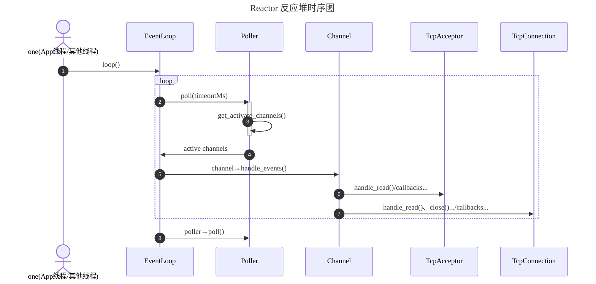
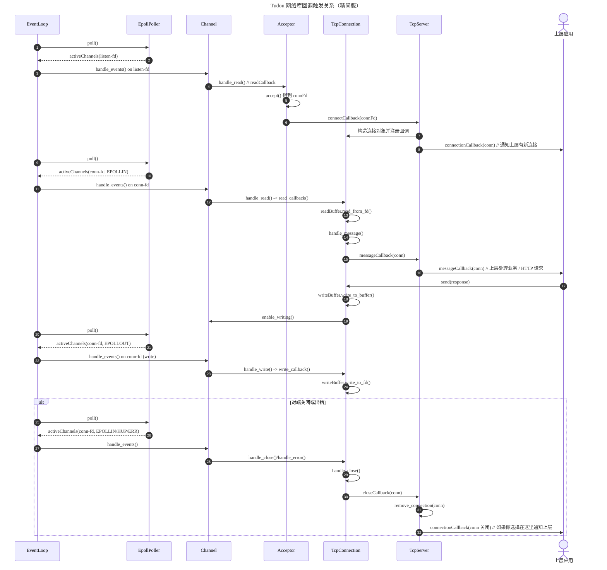

# Reactor 模式的 IO 多路复用

## Reactor 模式

## 系统架构图

## Reactor 模块时序图

## 整体时序图（Callback 回调流向）

## TcpServer 模块 UML 类图

## Citation

- https://github.com/chenshuo/muduo
- https://github.com/nodejs/llhttp

## References

- 陈硕. 《Linux 多线程服务器编程：使用 muduo C++ 网络库》. 电子工业出版社, 2013.
- [muduo 源码剖析 - bilibili](https://www.bilibili.com/video/BV1nu411Q7Gq?spm_id_from=333.788.videopod.sections&vd_source=5f255b90a5964db3d7f44633d085b6e4)
