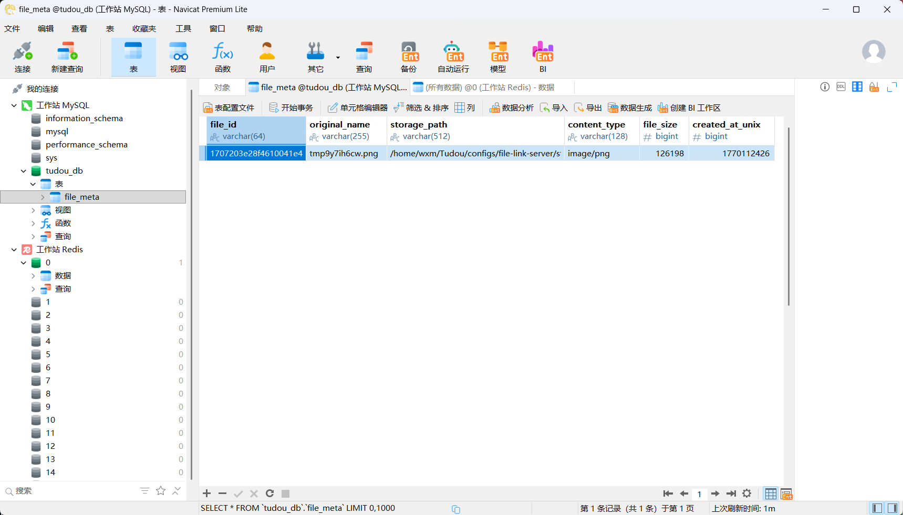
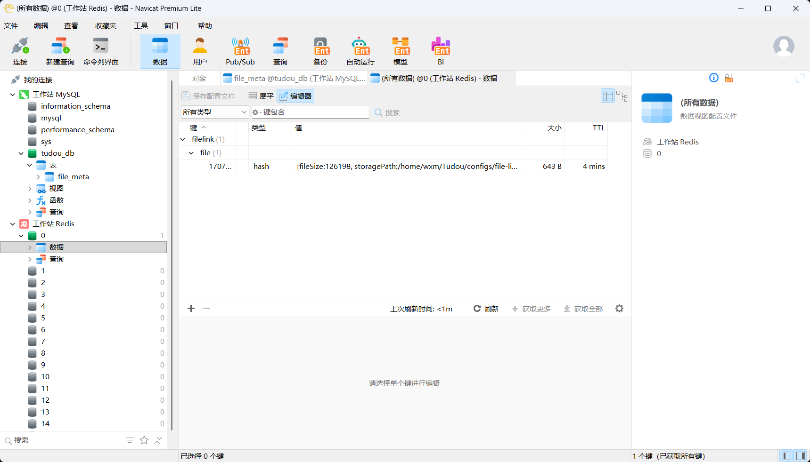

# Tudou：一个 Reactor 模式的高性能网络框架 🚀

```Plaintext
  _______          _            
 |__   __|        | |           
    | | _   _   __| |  ___   _   _ 
    | || | | | / _` | / _ \ | | | |
    | || |_| || (_| || (_) || |_| |
    |_| \__,_| \__,_| \___/  \__,_|
    
```

## Introduction ✅

Tudou 是一个基于 Reactor 模式的多线程高性能 C++ 网络框架，旨在构建高性能的网络服务器和应用程序。该框架的主要特性包括：

1. **Reactor 模式**: 使用 Reactor 模式，结合 IO 多路复用技术（如 epoll），实现高效的事件驱动网络编程。
2. **多线程**: 支持多线程模型，提升并发处理能力。
3. **高性能**: 通过优化的 I/O 处理和线程管理，实现高吞吐量和低延迟。
4. **HTTP 协议支持**: 内置对 HTTP 协议的支持，方便构建 Web 服务器等。
5. **HTTP 路由功能**: 提供路由机制，支持精确匹配和前缀匹配，灵活地将客户端请求映射到对应的服务器处理逻辑上，实现请求的分发与处理。 
6. ...

## Benchmark: wrk 性能测试 ⚡

进行性能测试的硬件配置：

- CPU: Intel(R) Xeon(R) Silver 4214R CPU (12 Cores, 24 Threads)
- RAM: 64 GB
- Disk: SSD
- Network: localhost loopback interface
- Operating System: Ubuntu 22.04.5 LTS

性能测试环境准备（wrk 下载编译）：

```bash
cd ~/ && git clone https://github.com/wg/wrk.git
cd wrk && make -j12
# 编译后 wrk 文件夹下会生成可执行文件 wrk，然后运行以下命令进行测试：
# ./wrk -t${线程数} -c${连接数} -d${测试时间}s --latency http://0.0.0.0:8080
# ./wrk -t1 -c200 -d10s --latency http://0.0.0.0:8080
```

### 单 Reactor 测试结果 🎢

```bash
wxm@wxm-Precision-7920-Tower:~/Tudou$ ../wrk/wrk -t1 -c200 -d60s --latency http://0.0.0.0:8080
Running 1m test @ http://0.0.0.0:8080
  1 threads and 200 connections
  Thread Stats   Avg      Stdev     Max   +/- Stdev
    Latency     0.98ms  329.35us   4.73ms   64.74%
    Req/Sec   105.18k     5.06k  116.32k    71.62%
  Latency Distribution
     50%    0.97ms
     75%    1.22ms
     90%    1.39ms
     99%    1.92ms
  6282090 requests in 1.00m, 688.97MB read
Requests/sec: 104632.12
Transfer/sec:     11.48MB
```

测试结果显示，在 **1 线程 + 200 并发连接下**，1 分钟内总共处理了 6282090 个请求，读取了 688.97 MB 数据，具体性能指标如下：

- 响应时间（Latency）：
  - **平均响应时间：0.98 ms**
  - 最大响应时间： 4.73 ms
  - 90% 请求的响应时间在 1.39 ms 以下
  - 99% 请求的响应时间在 1.92 ms 以下
- 吞吐量（Throughput）：
  - **每秒处理请求数（Requests/sec）：104632.12**
  - 每秒传输数据量（Transfer/sec）：11.48 MB

这些结果表明该服务器在单 Reactor 模式下能够高效地处理大量并发请求，具有较低的响应时间和较高的吞吐量。**作为对比，对 muduo** 实现的 TcpServer 的单线程性能进行了测试，结果如下：

```bash
# 简单 hello world TcpServer 单线程测试
# wxm@wxm-Precision-7920-Tower:~/build/release-cpp11$ ./bin/hello_http_server 8080 0 /home/wxm/muduo/test/hello-world.html fatal

wxm@wxm-Precision-7920-Tower:~/muduo$ ../wrk/wrk -t1 -c200 -d60s --latency http://0.0.0.0:8080
Running 1m test @ http://0.0.0.0:8080
  1 threads and 200 connections
  Thread Stats   Avg      Stdev     Max   +/- Stdev
    Latency   646.29us  168.61us   6.24ms   97.39%
    Req/Sec   159.68k     3.92k  164.84k    93.00%
  Latency Distribution
     50%  624.00us
     75%  645.00us
     90%  665.00us
     99%    1.27ms
  9533478 requests in 1.00m, 2.42GB read
Requests/sec: 158856.96
Transfer/sec:     41.36MB
```

发现 Tudou 和 muduo 还是有一些差距的，但已经很接近。整体上 Tudou 还有一些优化空间，后续会继续尝试改进提升性能。

### 多 Reactor 测试结果 🎢

开启 1 个 mainLoop 线程 + 16 个 ioLoop 线程：

```bash
wxm@wxm-Precision-7920-Tower:~/Tudou$ ../wrk/wrk -t6 -c600 -d60s --latency http://0.0.0.0:8080
Running 1m test @ http://0.0.0.0:8080
  6 threads and 600 connections
  Thread Stats   Avg      Stdev     Max   +/- Stdev
    Latency   556.19us  171.24us   5.19ms   79.65%
    Req/Sec    95.55k     9.06k  136.48k    86.06%
  Latency Distribution
     50%  535.00us
     75%  568.00us
     90%  639.00us
     99%    1.13ms
  34228589 requests in 1.00m, 3.67GB read
Requests/sec: 570232.21
Transfer/sec:     62.54MB
```

测试结果显示，在 **6 线程 + 600 并发连接下**，1 分钟内总共处理了 34228589 个请求，读取了 3.67 GB 数据，具体性能指标如下：

- 响应时间（Latency）：
  - **平均响应时间：556.19 us**
  - 最大响应时间：5.19 ms
  - 90% 请求的响应时间在 0.64 ms 以下
  - 99% 请求的响应时间在 1.13 ms 以下
- 吞吐量（Throughput）：
  - **每秒处理请求数（Requests/sec）：570232.21**
  - 每秒传输数据量（Transfer/sec）：62.54 MB

这些结果表明该服务器在多 Reactor 模式下能够显著提升并发处理能力，响应时间进一步降低，吞吐量大幅提升，展示了良好的扩展性和高性能。**同样作为对比，对 muduo** 实现的 TcpServer 的多线程性能进行了测试，结果如下：

```bash
# 多线程 hello world TcpServer 测试（1 mainLoop + 16 ioLoop）
# wxm@wxm-Precision-7920-Tower:~/build/release-cpp11$ ./bin/hello_http_server 8080 16 /home/wxm/muduo/test/hello-world.html fatal

wxm@wxm-Precision-7920-Tower:~/muduo$ ../wrk/wrk -t6 -c600 -d60s --latency http://0.0.0.0:8080
Running 1m test @ http://0.0.0.0:8080
  6 threads and 600 connections
  Thread Stats   Avg      Stdev     Max   +/- Stdev
    Latency   488.00us  117.88us   4.34ms   71.91%
    Req/Sec   104.97k     6.37k  134.46k    85.75%
  Latency Distribution
     50%  482.00us
     75%  558.00us
     90%  621.00us
     99%    0.98ms
  37600980 requests in 1.00m, 9.56GB read
Requests/sec: 626380.28
Transfer/sec:    163.08MB
```

发现 Tudou 和 muduo 在多线程模式下的性能差距有所缩小，基本接近但仍有一定差距。后续会继续优化 Tudou 的多线程性能，争取达到甚至超越 muduo 的水平。

## Requirements 🔍

- 单元测试需要 Google Test 库支持
    ```bash
    sudo apt-get update
    sudo apt-get install -y libgtest-dev
    ```
- llhttp HTTP 协议解析库（已集成在 Tudou 中，无需额外安装）
- spdlog 日志库（已集成在 Tudou 中，无需额外安装）
- C++11 or higher
- CMake 3.10 or higher

## Usage 🎯

使用 Tudou 编写的所有示例代码均位于 [/examples](./examples) 目录下。

### 静态文件服务器示例 ✨


我使用 Tudou 编写了一个静态文件服务器 `static-server`（详细代码样例见 [/examples/StaticFileHttpServer](./examples/StaticFileHttpServer)）。使用方式如下：

1. 编译项目（中的 StaticFileHttpServer 示例），生成可执行文件 `static-server`。

2. 创建配置文件目录结构并启动服务器（参考 [static-file-http-server 配置](./configs/static-file-http-server)）。配置文件目录结构如下：

    ```bash
    static-file-http-server
      ├─ conf
      │  └─ server.conf
      ├─ assets
      │  ├─ index.html
      │  ├─ xxx.html
      └─ log
         └─ server.log
    ```

    并配置 server.conf 文件，示例如下：
    
    ```yaml
    # Server IP and Port
    # Port: 0 ~ 1023 may require root privilege (Linux's port privilege)
    ip = 0.0.0.0
    port = 8080

    # Number of worker threads. 0 means only mainLoop thread is used.
    # More threads can handle more concurrent connections.
    threadNum = 1 # 1 mainLoop + 1 ioLoop (total 2 threads)
    ```

    在 server.conf 只需要设置好自己的 IP 地址、端口号、启用的线程数即可。在 assets 目录下放置好托管的静态文件。

3. 通过命令行运行服务器。在命令行终端中进入 `static-server` 可执行文件所在目录，运行以下命令启动服务器：

    ```bash
    ./static-server -r /path/to/directory/static-file-http-server
    ```

    其中 `/path/to/directory/static-file-http-server` 是配置文件目录的路径（如上所示的目录结构）。
    
    如果不指定 `-r` 参数，则默认（按照优先级顺序）在 `/etc/static-file-http-server/`、当前目录 `./static-file-http-server/` 下查找配置文件目录。因此为了方便起见，可以将配置文件目录结构放在 `/etc/static-file-http-server/` 目录下。
    
4. 访问静态文件。启动服务器后，可以通过浏览器或 curl 访问对应的 URL 来获取静态文件内容。例如，如果服务器运行在本地机器的 8080 端口上，可以通过以下 URL 访问：`http://localhost:8080/index.html`（xxx.png,etc.）。

综上，只需按照上述步骤：编译运行 `static-server` 可执行文件；创建配置文件目录结构，配置 server.conf 文件、静态文件。即可启动一个高性能的静态文件 HTTP 服务器，支持多线程处理请求。通过浏览器或 curl 访问对应的 URL 即可获取静态文件内容。

### FileLink Server 示例 ✨

网站主页：


元数据管理界面（MySQL + Redis）：

 



我使用 Tudou 实现了另一个功能：用户上传一个文件，后端将其组织存储，同时生成一个 URL 返回给前端，用户后续可以使用这个得到的 URL 访问或者下载该文件。

设计采用经典的客户端-服务器架构，前端通过 HTTP 协议与后端通信。后端使用 Tudou 实现高性能的 HTTP 服务器，处理文件上传和下载请求。设计采用 “元数据存数据库（MySQL）+ 文件实体存磁盘 + 热点数据存 Redis” 的经典架构。这种方式既能利用磁盘的大容量存储文件，又能利用数据库管理文件属性，同时利用 Redis 极大地提高文件索引速度。具体实现见 [/examples/FileLinkServer](./examples/FileLinkServer) 。

使用方式和静态文件服务器类似：编译项目，创建配置文件目录结构（[filelink-server 配置](./configs/file-link-server/)）并启动服务器。启动服务器时，配置文件目录可以放在 `/etc/file-link-server/`、当前目录，或者通过 `-r` 参数指定路径。最后访问对应的 URL 即可上传和下载文件。

环境要求：

1. 需要 MySQL 和 Redis 环境支持（若没有配置该环境则自动退化为无数据库和缓存模式）。可以使用 Docker 快速部署 MySQL 和 Redis 服务（见 [docker-compose.yml](./docker-compose.yml)）。
2. 需要安装 MySQL C++ Connector 库（`libmysqlcppconn-dev`）、hiredis 库（`libhiredis-dev`），以便能够使用 C++ 连接 MySQL 和 Redis 服务端进行操作。

    ```bash
    sudo apt-get update
    sudo apt-get install -y libmysqlcppconn-dev libhiredis-dev
    ```

## Citation 📚

- 网络库（muduo）：https://github.com/chenshuo/muduo
- Http 协议解析库（llhttp）：https://github.com/nodejs/llhttp
- 日志库（spdlog）：https://github.com/gabime/spdlog
- 单元测试框架（Google Test）：https://github.com/google/googletest
- 压力测试工具（wrk）：https://github.com/wg/wrk

## Others

- 陈硕. 《Linux 多线程服务器编程：使用 muduo C++ 网络库》. 电子工业出版社, 2013.
- [muduo 源码剖析 - bilibili](https://www.bilibili.com/video/BV1nu411Q7Gq?spm_id_from=333.788.videopod.sections&vd_source=5f255b90a5964db3d7f44633d085b6e4)
- [llhttp 使用 - 知乎专栏](https://zhuanlan.zhihu.com/p/416575096)
- [spdlog 使用 - CSDN博客](https://blog.csdn.net/tutou_gou/article/details/121284474)
- [spdlog 使用](https://shuhaiwen.github.io/technical-documents/Documents/B-Programming%20Language/C%2B%2B/%E5%BC%80%E6%BA%90%E5%BA%93/spdlog/spdlog%E6%95%99%E7%A8%8B/)
