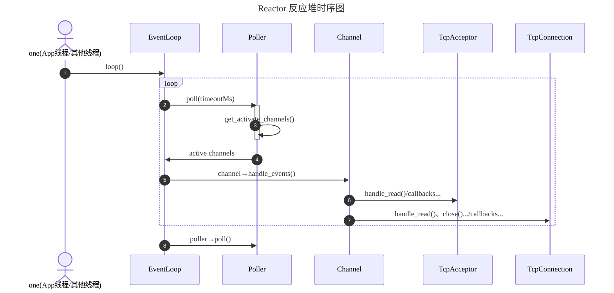

# Reactor 模式的 IO 多路复用

## 系统架构图

## Reactor 模式



## 各类及其职责说明

- **EventLoop**：事件循环驱动者。持有 EpollPoller，使用 EpollPoller 获取 activeChannels 并驱动 activeChannels 触发回调处理事件
- **EpollPoller**：多路复用及 channels 管理中心。封装了 epoll_create、epoll_wait、epoll_ctl 等系统调用
- **Channel**：回调分发器。封装了 fd 及其感兴趣的事件，负责在事件发生时根据相应的事件调用相应的回调函数处理事件
- **Acceptor**：连接接受器。持有 fd、channel；还持有回调函数 connectCallback 用于执行上层 TcpServer 的连接回调，当建立新连接时触发调用。callback 用于处理 channel 新连接到来事件
- **TcpConnection**：TCP 连接封装器。持有 fd、channel、读写缓冲区 buffer；还持有回调函数 closeCallback、messageCallback 用于执行上层 TcpServer 的连接关闭回调和消息处理回调，当连接关闭、可读时触发回调。callback 用于处理 channel 读写事件和关闭事件
- **Buffer**：缓冲区类。持有 `vector<char>` 作为底层存储空间，设计参考 Netty 的 ByteBuf，提供向缓冲区写入数据、从缓冲区读取数据等接口供上层使用，也提供了向 fd 读写数据的接口用于 event 触发时 TcpConnection 的回调函数使用
- **TcpServer**：TCP 服务器。持有 acceptor 和管理 tcpConnections；还持有回调函数 connectionCallback、messageCallback 用于执行上层应用的连接建立、断开回调和消息处理回调，当有新连接建立（断开）、收到消息时触发调用。callback 用于处理 acceptor 的新连接事件和 tcpConnection 的断开、消息处理事件
- **llhttp**：HTTP 解析器（第三方库，Node.js 使用的 HTTP 解析器）。用于解析 HTTP 请求报文。
- **HttpResponse**：HTTP 响应封装器。用于构造 HTTP 响应报文。
- **HttpRequest**：HTTP 请求封装器。用于封装 HTTP 请求报文数据，类似一个数据结构体。
- **HttpContext**：HTTP 解析器。持有 llhttp 解析器实例、HttpRequest 实例，用于解析 HTTP 请求报文，并将解析结果存入 HttpRequest 实例中。
- **HttpServer**：HTTP 服务器。持有 TcpServer 实例；还持有回调函数 httpCallback 用于执行上层应用的 HTTP 请求处理回调，当收到 HTTP 请求时触发调用。callback（on_message、on_connection） 用于处理 TcpServer 的消息处理事件和连接建立、断开事件

## Benchmark

### 硬件配置

- CPU: Intel(R) Xeon(R) Silver 4214R CPU (12 Cores, 24 Threads)
- RAM: 64 GB
- Disk: SSD
- Network: localhost loopback interface
- Operating System: Ubuntu 22.04.5 LTS

### Wrk 测试

环境准备：

```bash
# git clone https://github.com/wg/wrk.git
# cd wrk
# make -j12
# 编译后 wrk 文件夹下会生成可执行文件 wrk，然后运行以下命令进行测试：
./wrk -t12 -c400 -d60s --latency http://127.0.0.1:8080
```

测试结果：

```bash
wxm@wxm-Precision-7920-Tower:~/wrk$ ./wrk -t12 -c400 -d60s --latency http://127.0.0.1:8080
Running 1m test @ http://127.0.0.1:8080
  12 threads and 400 connections
  Thread Stats   Avg      Stdev     Max   +/- Stdev
    Latency    13.54ms   33.00ms   1.14s    99.45%
    Req/Sec     2.87k   243.18     9.55k    97.73%
  Latency Distribution
     50%   11.53ms
     75%   11.67ms
     90%   11.92ms
     99%   13.05ms
  2050730 requests in 1.00m, 21.43GB read
Requests/sec:  34152.12
Transfer/sec:    365.53MB
```

测试结果显示，在 12 线程 + 400 并发连接下，1 分钟内总共处理了 2050730 个请求，读取了 21.43 GB 数据，具体性能指标如下：

- 响应时间（Latency）：
  - 平均响应时间：13.54 ms
  - 最大响应时间：1.14 s
  - 90% 请求的响应时间在 11.92 ms 以下
  - 99% 请求的响应时间在 13.05 ms 以下
- 吞吐量（Throughput）：
  - 每秒处理请求数（Requests/sec）：34152.12
  - 带宽（Transfer/sec）：365.53 MB/s

### Apache Bench 测试

环境准备：

```bash
# sudo apt-get update
# sudo apt-get install apache2-utils
# 然后运行以下命令进行测试：
ab -n 1000 -c 10 http://127.0.0.1:8080/
```

测试结果：

```bash
wxm@wxm-Precision-7920-Tower:~$ ab -n 1000 -c 10 -k -s 60 http://127.0.0.1:8080/
This is ApacheBench, Version 2.3 <$Revision: 1879490 $>
Copyright 1996 Adam Twiss, Zeus Technology Ltd, http://www.zeustech.net/
Licensed to The Apache Software Foundation, http://www.apache.org/

Benchmarking 127.0.0.1 (be patient)
apr_pollset_poll: The timeout specified has expired (70007)
```

通过 curl 命令可以看到服务器正确响应，不知道什么原因 ab 会报错，懒得管了...似乎是 ab 对 keep-alive 更加严格一些。

```bash
 curl -v http://127.0.0.1:8080/ -o /dev/null
```

## Citation

- 网络库：https://github.com/chenshuo/muduo
- Http 协议解析库：https://github.com/nodejs/llhttp
- 日志库：https://github.com/gabime/spdlog
- 压力测试工具：https://github.com/wg/wrk

## References

- 陈硕. 《Linux 多线程服务器编程：使用 muduo C++ 网络库》. 电子工业出版社, 2013.
- [muduo 源码剖析 - bilibili](https://www.bilibili.com/video/BV1nu411Q7Gq?spm_id_from=333.788.videopod.sections&vd_source=5f255b90a5964db3d7f44633d085b6e4)
- [llhttp 使用 - 知乎专栏](https://zhuanlan.zhihu.com/p/416575096)
- [spdlog 使用 - CSDN博客](https://blog.csdn.net/tutou_gou/article/details/121284474)
- [spdlog 使用](https://shuhaiwen.github.io/technical-documents/Documents/B-Programming%20Language/C%2B%2B/%E5%BC%80%E6%BA%90%E5%BA%93/spdlog/spdlog%E6%95%99%E7%A8%8B/)