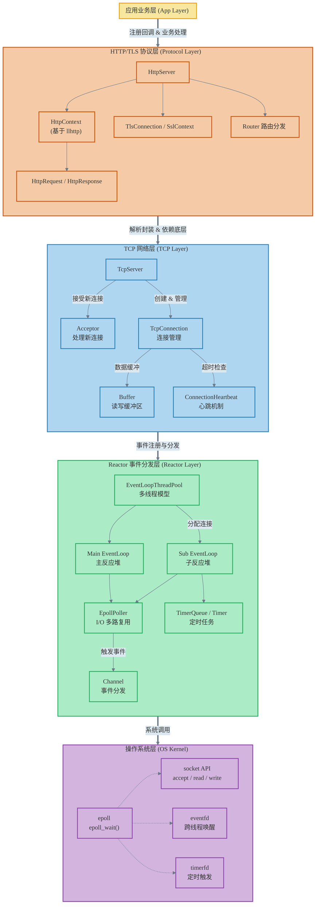
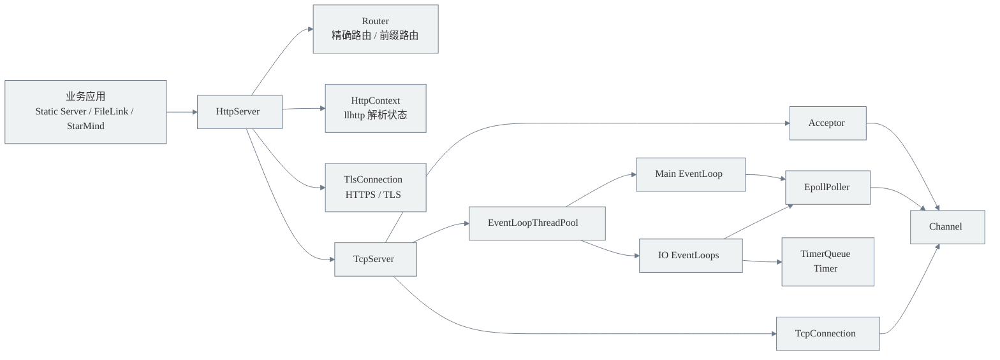

# Tudou ⚡

<p align="center">
  <strong>一个面向 Linux 的多线程 Reactor 网络框架</strong><br />
  基于 epoll / eventfd / timerfd 构建，提供 TCP、HTTP/HTTPS、路由、定时器与连接空闲检测能力。
</p>

<p align="center">
  
  
  
  
  
</p>

<p align="center">
  <a href="#架构总览">🏗️ 架构总览</a> ·
  <a href="#性能测试">📈 性能测试</a> ·
  <a href="#快速开始">🚀 快速开始</a> ·
  <a href="#使用示例">🧩 使用示例</a> ·
  <a href="#文档导航">📚 文档导航</a>
</p>

> Tudou 的核心库会编译为静态库 `tudou`，源码位于 [src](./src)。
> 当前仓库在核心库之上提供了 3 个可直接运行的完整示例应用：
> [static-server](./examples/StaticFileHttpServer)、[filelink-server](./examples/FileLinkServer)、[StarMind](./examples/StarMind)。

> [!IMPORTANT]
> Tudou 当前以 Linux 为目标平台，依赖 epoll、eventfd、timerfd 等 Linux 特性。

## 项目亮点 ✨

| 方向 | 当前能力 |
| --- | --- |
| Reactor 模型 | one loop per thread；1 个 main loop 负责接入，N 个 IO loop 负责连接读写与事件处理 |
| TCP 核心 | EventLoop、EpollPoller、Channel、Acceptor、TcpServer、TcpConnection、Buffer |
| HTTP 能力 | 基于 llhttp 的 HTTP 解析；HttpRequest / HttpResponse；内部 Router 直接支持业务路由注册 |
| HTTPS 能力 | HttpServer 在 `start()` 前通过 `enable_ssl(cert, key)` 启用 TLS；底层使用 OpenSSL 维护单连接 TLS 状态 |
| 路由能力 | 支持 method + path 精确匹配、前缀路由兜底、自定义 404 / 405 处理器 |
| 定时与保活 | 内置 TimerQueue / Timer；提供 ConnectionHeartbeat 做连接空闲检测与超时断连 |
| 工程配套 | CMake 构建、单元测试、集成测试可执行程序、示例配置、架构与设计文档 |

<a id="架构总览"></a>

## 架构总览 🏗️

### 系统分层图


```mermaid
%%{init: {
  "theme": "base",
  "themeVariables": {
    "fontFamily": "Inter, Helvetica, sans-serif",
    "fontSize": "16px",
    "primaryColor": "#eef2f3",
    "primaryTextColor": "#333",
    "primaryBorderColor": "#6c7a89",
    "lineColor": "#6c7a89",
    "secondaryColor": "#dce8f0",
    "tertiaryColor": "#fdfdfd"
  }
}}%%

flowchart TD
  classDef appLayer fill:#f9e79f,stroke:#f39c12,stroke-width:2px,color:#333
  classDef httpLayer fill:#f5cba7,stroke:#d35400,stroke-width:2px,color:#333
  classDef tcpLayer fill:#aed6f1,stroke:#2980b9,stroke-width:2px,color:#333
  classDef reactorLayer fill:#abebc6,stroke:#27ae60,stroke-width:2px,color:#333
  classDef osLayer fill:#d2b4de,stroke:#8e44ad,stroke-width:2px,color:#333

  subgraph AppBusiness ["应用业务层 (App Layer)"]
  end

  subgraph HttpLayer ["HTTP/TLS 协议层 (Protocol Layer)"]
    direction TB
    HttpSrv["HttpServer"]
    HttpCtx["HttpContext\n(基于 llhttp)"]
    HttpReq["HttpRequest / HttpResponse"]
    TlsConn["TlsConnection / SslContext"]
    Router2["Router 路由分发"]

    HttpSrv --> HttpCtx
    HttpSrv --> TlsConn
    HttpCtx --> HttpReq
    HttpSrv --> Router2
  end

  subgraph NetLayer ["TCP 网络层 (TCP Layer)"]
    direction TB
    TcpSrv["TcpServer"]
    Acceptor2["Acceptor\n处理新连接"]
    TcpConn["TcpConnection\n连接管理"]
    Buffer2["Buffer\n读写缓冲区"]
    Heartbeat2["ConnectionHeartbeat\n心跳机制"]

    TcpSrv -->|接受新连接| Acceptor2
    TcpSrv -->|创建 & 管理| TcpConn
    TcpConn -->|数据缓冲| Buffer2
    TcpConn -->|超时检查| Heartbeat2
  end

  subgraph ReactorLayer ["Reactor 事件分发层 (Reactor Layer)"]
    direction TB
    ThreadPool["EventLoopThreadPool\n多线程模型"]
    MainLoop2["Main EventLoop\n主反应堆"]
    SubLoop["Sub EventLoop\n子反应堆"]
    Poller2["EpollPoller\nI/O 多路复用"]
    Channel2["Channel\n事件分发"]
    TimerQ["TimerQueue / Timer\n定时任务"]

    ThreadPool --> MainLoop2
    ThreadPool -->|分配连接| SubLoop
    MainLoop2 --> Poller2
    SubLoop --> Poller2
    Poller2 -->|触发事件| Channel2
    SubLoop --> TimerQ
  end

  subgraph OS_Kernel ["操作系统层 (OS Kernel)"]
    direction LR
    Epoll["epoll\nepoll_wait()"]
    Socket["socket API\naccept / read / write"]
    EventFd["eventfd\n跨线程唤醒"]
    TimerFd["timerfd\n定时触发"]

    Epoll -.-> Socket
    Epoll -.-> EventFd
    Epoll -.-> TimerFd
  end

  AppBusiness ==>|注册回调 & 业务处理| HttpLayer
  HttpLayer ==>|解析封装 & 依赖底层| NetLayer
  NetLayer ==>|事件注册与分发| ReactorLayer
  ReactorLayer ==>|系统调用| OS_Kernel

  class AppBusiness,App,UserCallbacks appLayer
  class HttpLayer,HttpSrv,HttpCtx,HttpReq,TlsConn,Router2 httpLayer
  class NetLayer,TcpSrv,Acceptor2,TcpConn,Buffer2,Heartbeat2 tcpLayer
  class ReactorLayer,ThreadPool,MainLoop2,SubLoop,Poller2,Channel2,TimerQ reactorLayer
  class OS_Kernel,Epoll,Socket,EventFd,TimerFd osLayer
```

如果你想看更完整的类图、模块分层和设计说明，推荐直接阅读 [docs/Architecture.md](./docs/Architecture.md)。

### 快速调用链


```mermaid
%%{init: {
    "theme": "base",
    "themeVariables": {
        "fontFamily": "Inter, Helvetica, sans-serif",
        "fontSize": "16px",
        "primaryColor": "#eef2f3",
        "primaryTextColor": "#333",
        "primaryBorderColor": "#6c7a89",
        "lineColor": "#6c7a89"
    }
}}%%
flowchart LR
    App[业务应用\nStatic Server / FileLink / StarMind] --> HttpServer[HttpServer]
    HttpServer --> Router[Router\n精确路由 / 前缀路由]
    HttpServer --> HttpContext[HttpContext\nllhttp 解析状态]
    HttpServer --> Tls[TlsConnection\nHTTPS / TLS]
    HttpServer --> TcpServer[TcpServer]

    TcpServer --> Acceptor[Acceptor]
    Acceptor --> Channel[Channel]

    TcpServer --> Pool[EventLoopThreadPool]
    Pool --> MainLoop[Main EventLoop]
    MainLoop --> Poller[EpollPoller]
    Poller --> Channel
    Pool --> IoLoops[IO EventLoops]
    IoLoops --> Poller
    IoLoops --> TimerQueue[TimerQueue \n Timer]
    

    TcpServer --> Conn[TcpConnection]
    Conn --> Channel

    class App,HttpServer,Router,HttpContext,Tls httpNode
    class TcpServer,Acceptor,Conn,Buffer,Heartbeat tcpNode
    class Pool,MainLoop,IoLoops,Poller,Channel,TimerQueue reactorNode
```

<a id="性能测试"></a>

## 性能测试 📈

以下是仓库当前记录的 `wrk` 压测结果，测试对象为静态文件服务场景，运行环境如下：

- CPU：Intel(R) Xeon(R) Silver 4214R CPU (12 Cores, 24 Threads)
- RAM：64 GB
- Disk：SSD
- Network：localhost loopback
- OS：Ubuntu 22.04.5 LTS

`wrk` 准备方式：

```bash
cd ~
git clone https://github.com/wg/wrk.git
cd wrk && make -j12
```

测试过程：

```bash
wxm@wxm-Precision-7920-Tower:~/Tudou$ ../wrk/wrk -t6 -c600 -d60s --latency http://0.0.0.0:8080
Running 1m test @ http://0.0.0.0:8080
  6 threads and 600 connections
  Thread Stats   Avg      Stdev     Max   +/- Stdev
    Latency   556.19us  171.24us   5.19ms   79.65%
    Req/Sec    95.55k     9.06k  136.48k    86.06%
  Latency Distribution
     50%  535.00us
     75%  568.00us
     90%  639.00us
     99%    1.13ms
  34228589 requests in 1.00m, 3.67GB read
Requests/sec: 570232.21
Transfer/sec:     62.54MB
```

性能摘要：

| 场景 | 压测参数 | 对象 | 平均延迟 | Requests/sec | Transfer/sec |
| --- | --- | --- | --- | --- | --- |
| 单 Reactor | 1 线程 / 200 连接 | Tudou | 0.98 ms | 104632.12 | 11.48 MB |
| 单 Reactor | 1 线程 / 200 连接 | muduo `hello_http_server` | 646.29 us | 158856.96 | 41.36 MB |
| 多 Reactor | 6 线程 / 600 连接 | Tudou（1 main loop + 16 io loop） | 556.19 us | 570232.21 | 62.54 MB |
| 多 Reactor | 6 线程 / 600 连接 | muduo `hello_http_server`（1 main loop + 16 io loop） | 488.00 us | 626380.28 | 163.08 MB |

这些数据说明 Tudou 已经具备不错的并发处理能力；同时也说明，与 muduo 对比仍有优化空间，尤其是在静态文件服务场景下的吞吐与尾延迟方面。

<a id="快速开始"></a>

## 快速开始 🛠️

### 依赖项

| 依赖 | 是否需要 | 用途 |
| --- | --- | --- |
| g++ / clang++ | 必需 | 建议使用支持 C++17 的编译器；核心库按 C++14 编写，单元测试目标当前使用 C++17 |
| CMake 3.10+ | 必需 | 项目构建 |
| OpenSSL (`libssl-dev`) | 必需 | 核心库链接依赖，提供 HTTPS / SHA-256 等能力 |
| Google Test (`libgtest-dev`) | 可选 | 构建并运行单元测试 |
| libcurl (`libcurl4-openssl-dev`) | StarMind 需要 | 调用 OpenAI-compatible LLM API |
| MySQL Connector/C++ (`libmysqlcppconn-dev`) | FileLink 可选 | 持久化文件元数据 |
| hiredis (`libhiredis-dev`) | FileLink 可选 | 热点元数据缓存 |
| llhttp / spdlog | 仓库内置 | 无需额外安装 |

Ubuntu 一键安装示例：

```bash
sudo apt-get update && sudo apt-get install -y \
    build-essential \
    cmake \
    libssl-dev \
    libgtest-dev \
    libcurl4-openssl-dev \
    libmysqlcppconn-dev \
    libhiredis-dev \
    openssl
```

初始化本地 HTTPS 测试证书：

```bash
mkdir -p certs
openssl req -x509 -newkey rsa:2048 \
    -keyout certs/test-key.pem \
    -out certs/test-cert.pem \
    -days 365 -nodes \
    -subj "/C=CN/ST=BJ/L=BJ/O=TudouProject/CN=localhost"
```

### 构建

```bash
cmake -B build -DCMAKE_BUILD_TYPE=Debug
cmake --build build -j2
```

按目标单独构建：

```bash
cmake --build build --target static-server -j2
cmake --build build --target filelink-server -j2
cmake --build build --target StarMind -j2
cmake --build build --target TudouUnitTest -j2
```

### 测试

运行单元测试：

```bash
cd build && ctest -R unitTest --output-on-failure
```

运行单个测试：

```bash
cd build && ./test/unitTest/TudouUnitTest --gtest_filter=RouterTest*
```

仓库还包含若干集成测试可执行程序，例如 `TudouIntegrateTest`、`StaticFileTcpServer` 与 `https-test`；其中部分用于人工联调，不会默认注册到 CTest。

<a id="使用示例"></a>

## 使用示例 🧩

### 最小 HTTP Server 示例

下面这段代码展示了当前 `HttpServer` 的典型使用方式：

```cpp
#include "tudou/http/HttpRequest.h"
#include "tudou/http/HttpResponse.h"
#include "tudou/http/HttpServer.h"

int main() {
    // 创建 HttpServer 实例，监听 8080 端口，IO 线程数为 0（即只有一个 Listener 线程。可以自定义启用多线程 Reactor 模式）
    HttpServer server("0.0.0.0", 8080, 0);

    server.add_get_route("/ping", [](const HttpRequest&, HttpResponse& resp) {
        resp.set_status(200, "OK");
        resp.set_header("Content-Type", "text/plain; charset=utf-8");
        resp.set_body("pong\n");
        resp.set_close_connection(false);
    });

    // 可选：在 start() 之前启用 HTTPS
    // server.enable_ssl("certs/test-cert.pem", "certs/test-key.pem");

    server.start();
    return 0;
}
```

如果你更关心完整可运行项目，而不是最小 API 示例，请直接看下面三个示例程序。

| 目标 | 配置目录 | 适用场景 | 亮点 |
| --- | --- | --- | --- |
| `static-server` | [configs/static-file-http-server](./configs/static-file-http-server) | 静态资源托管 | GET / HEAD、前缀路由、简单文件缓存、测试证书 HTTPS |
| `filelink-server` | [configs/file-link-server](./configs/file-link-server) | 文件上传、URL 分发与下载 | 内容寻址存储、软去重、可选 MySQL / Redis、可选 HTTPS |
| `StarMind` | [configs/starmind](./configs/starmind) | AI 聊天 Web 服务 | 登录鉴权、会话管理、OpenAI-compatible LLM API、前端页面 |

### static-server 示例

<p align="center">
  
</p>

`static-server` 是最直接的 Tudou 演示程序：

- 使用 `HttpServer::add_prefix_route("/", ...)` 做统一静态资源分发。
- 支持 `GET` 与 `HEAD`。
- 启动时会尝试加载仓库下的测试证书 `certs/test-cert.pem` / `certs/test-key.pem`。

推荐从仓库根目录运行：

```bash
cmake --build build --target static-server -j2
./build/examples/StaticFileHttpServer/static-server -r ./configs/static-file-http-server
```

配置文件目录结构示例：

```text
static-file-http-server/
├── conf/server.conf
├── assets/
└── log/server.log
```

启动后可访问：

- `http://127.0.0.1:8080/index.html`
- 如果测试证书可用，也可以尝试 `https://127.0.0.1:8080/index.html`

### filelink-server 示例

<p align="center">
  
</p>

<p align="center">
  
  
</p>

`filelink-server` 展示了 Tudou 在真实业务服务中的用法：

- `POST /upload` 上传文件，并返回一个下载链接。
- `GET /file/{id}` 按链接下载文件。
- 文件内容写入 `blobs/{sha256}`，对相同内容做软去重；对外仍保留独立 `fileId`。
- 可选接入 MySQL 保存元数据、Redis 做热点缓存；如果缺少对应依赖，会自动退化到内存 / 空缓存实现。
- 可通过配置启用账号密码鉴权与 HTTPS。

启动命令：

```bash
cmake --build build --target filelink-server -j2
./build/examples/FileLinkServer/filelink-server -r ./configs/file-link-server
```

常用入口：

- 首页：`GET /`
- 登录：`POST /login`
- 上传：`POST /upload`，请求头中需要 `X-File-Name`
- 下载：`GET /file/{id}`

如果你想快速准备依赖环境，可以使用仓库里的 [docker-compose.yml](./docker-compose.yml) 启动 MySQL 和 Redis。

### StarMind 示例

<p align="center">
  
</p>

`StarMind` 是一个基于 Tudou 的 AI 聊天 Web 服务示例：

- Web 页面提供登录与聊天界面。
- 后端通过 libcurl 调用 OpenAI-compatible API。
- 配置文件内可设置 `llm.api_base`、`llm.api_key`、`llm.model`、系统提示词、历史消息数上限等参数。

启动命令：

```bash
cmake --build build --target StarMind -j2
./build/examples/StarMind/StarMind -r ./configs/starmind
```

常用入口：

- 登录页：`GET /login`
- 聊天页：`GET /chat`
- 登录 API：`POST /api/login`
- 聊天 API：`POST /api/chat`

<a id="文档导航"></a>

## 文档导航 📚

如果你希望继续深入，而不仅仅停留在使用层，建议按下面的顺序阅读：

- [docs/Architecture.md](./docs/Architecture.md)：完整架构图、类关系图与模块分层。
- [docs/生命周期管理详解.md](./docs/生命周期管理详解.md)：对象所有权、共享生命周期与回调期间存活问题。
- [docs/深入理解回调.md](./docs/深入理解回调.md)：框架中回调的设计方式与分层通信。
- [docs/OneLoopPerThread 设计：线程归属、无锁编程与跨线程唤醒.md](./docs/OneLoopPerThread%20%E8%AE%BE%E8%AE%A1%EF%BC%9A%E7%BA%BF%E7%A8%8B%E5%BD%92%E5%B1%9E%E3%80%81%E6%97%A0%E9%94%81%E7%BC%96%E7%A8%8B%E4%B8%8E%E8%B7%A8%E7%BA%BF%E7%A8%8B%E5%94%A4%E9%86%92.md)：线程模型与唤醒机制。
- [docs/Channel 的 tie 机制：回调期间的生命周期护栏.md](./docs/Channel%20%E7%9A%84%20tie%20%E6%9C%BA%E5%88%B6%EF%BC%9A%E5%9B%9E%E8%B0%83%E6%9C%9F%E9%97%B4%E7%9A%84%E7%94%9F%E5%91%BD%E5%91%A8%E6%9C%9F%E6%8A%A4%E6%A0%8F.md)：Channel 与 TcpConnection 的生命周期护栏。
- [docs/定时器队列设计：基于 Linux timerfd 和 std::map.md](./docs/%E5%AE%9A%E6%97%B6%E5%99%A8%E9%98%9F%E5%88%97%E8%AE%BE%E8%AE%A1%EF%BC%9A%E5%9F%BA%E4%BA%8E%20Linux%20timerfd%20%E5%92%8C%20std%3A%3Amap.md)：TimerQueue 的设计取舍。
- [docs/心跳检测设计：三层防御体系与失活连接清理.md](./docs/%E5%BF%83%E8%B7%B3%E6%A3%80%E6%B5%8B%E8%AE%BE%E8%AE%A1%EF%BC%9A%E4%B8%89%E5%B1%82%E9%98%B2%E5%BE%A1%E4%BD%93%E7%B3%BB%E4%B8%8E%E5%A4%B1%E6%B4%BB%E8%BF%9E%E6%8E%A5%E6%B8%85%E7%90%86.md)：空闲检测与连接回收策略。
- [docs/路由模块设计：高效的请求分发.md](./docs/%E8%B7%AF%E7%94%B1%E6%A8%A1%E5%9D%97%E8%AE%BE%E8%AE%A1%EF%BC%9A%E9%AB%98%E6%95%88%E7%9A%84%E8%AF%B7%E6%B1%82%E5%88%86%E5%8F%91.md)：Router 的分发模型与约束。

## 参考与致谢 🤝

- 网络库（muduo）：https://github.com/chenshuo/muduo
- HTTP 解析库（llhttp）：https://github.com/nodejs/llhttp
- 日志库（spdlog）：https://github.com/gabime/spdlog
- 单元测试框架（Google Test）：https://github.com/google/googletest
- 压测工具（wrk）：https://github.com/wg/wrk

## 延伸阅读 🔎

- 陈硕，《Linux 多线程服务器编程：使用 muduo C++ 网络库》
- [muduo 源码剖析 - bilibili](https://www.bilibili.com/video/BV1nu411Q7Gq?spm_id_from=333.788.videopod.sections&vd_source=5f255b90a5964db3d7f44633d085b6e4)
- [llhttp 使用 - 知乎专栏](https://zhuanlan.zhihu.com/p/416575096)
- [spdlog 使用 - CSDN 博客](https://blog.csdn.net/tutou_gou/article/details/121284474)
- [spdlog 使用教程](https://shuhaiwen.github.io/technical-documents/Documents/B-Programming%20Language/C%2B%2B/%E5%BC%80%E6%BA%90%E5%BA%93/spdlog/spdlog%E6%95%99%E7%A8%8B/)
