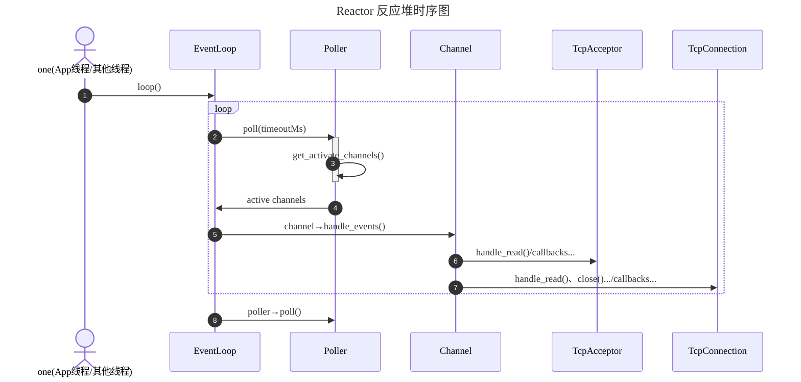

# 开发 Tudou 过程中学到的一些东西

## Reactor 模式

## 各类及其职责说明

- **EventLoop**：事件循环驱动者。持有 EpollPoller，使用 EpollPoller 获取 activeChannels 并驱动 activeChannels 触发回调处理事件
- **EpollPoller**：多路复用及 channels 管理中心。封装了 epoll_create、epoll_wait、epoll_ctl 等系统调用
- **Channel**：回调分发器。封装了 fd 及其感兴趣的事件，负责在事件发生时根据相应的事件调用相应的回调函数处理事件
- **Acceptor**：连接接受器。持有 fd、channel；还持有回调函数 connectCallback 用于执行上层 TcpServer 的连接回调，当建立新连接时触发调用。callback 用于处理 channel 新连接到来事件
- **TcpConnection**：TCP 连接封装器。持有 fd、channel、读写缓冲区 buffer；还持有回调函数 closeCallback、messageCallback 用于执行上层 TcpServer 的连接关闭回调和消息处理回调，当连接关闭、可读时触发回调。callback 用于处理 channel 读写事件和关闭事件
- **Buffer**：缓冲区类。持有 `vector<char>` 作为底层存储空间，设计参考 Netty 的 ByteBuf，提供向缓冲区写入数据、从缓冲区读取数据等接口供上层使用，也提供了向 fd 读写数据的接口用于 event 触发时 TcpConnection 的回调函数使用
- **TcpServer**：TCP 服务器。持有 acceptor 和管理 tcpConnections；还持有回调函数 connectionCallback、messageCallback 用于执行上层应用的连接建立、断开回调和消息处理回调，当有新连接建立（断开）、收到消息时触发调用。callback 用于处理 acceptor 的新连接事件和 tcpConnection 的断开、消息处理事件
- **llhttp**：HTTP 解析器（第三方库，Node.js 使用的 HTTP 解析器）。用于解析 HTTP 请求报文。
- **HttpResponse**：HTTP 响应封装器。用于构造 HTTP 响应报文。
- **HttpRequest**：HTTP 请求封装器。用于封装 HTTP 请求报文数据，类似一个数据结构体。
- **HttpContext**：HTTP 解析器。持有 llhttp 解析器实例、HttpRequest 实例，用于解析 HTTP 请求报文，并将解析结果存入 HttpRequest 实例中。
- **HttpServer**：HTTP 服务器。持有 TcpServer 实例；还持有回调函数 httpCallback 用于执行上层应用的 HTTP 请求处理回调，当收到 HTTP 请求时触发调用。callback（on_message、on_connection） 用于处理 TcpServer 的消息处理事件和连接建立、断开事件

## 深入理解回调

Tudou 是面向对象开发，因此我把回调定义为类之间的一种通信方式（特别是从子类到父类，即“从下到上”），这种通信当然很大程度上是为了实现灵活的**事件处理和类之间的解耦**。回调函数实际上就**可以看作是上层类调用函数，只不过由下层类在事件发生时进行触发**。回调的特性有：

- **异步性**：回调的核心特性。回调通常在某个事件发生后被触发调用，而不是立即执行，这也是为什么我们选择回调而不是直接调用函数的原因，当我们**需要某个事件发生时触发执行某些操作**（Reactor 模式中尤为常见），这时可以通过设置回调（钩子）实现异步处理。

- **解耦**：回调允许**类之间通过函数接口（而不是某个抽象类）进行通信**，比较轻便。特别是子类需要依赖父类的某些功能时，回调可以让**子类在不直接依赖父类实现的情况下调用父类的方法**，从而实现解耦。

- **回调 VS 正常函数调用**：一般我们习惯的正常调用是从“上到下”的调用，或者可以想象一个大框不断嵌套小框、调用栈等，从上到下是大框套小框的过程、调用栈压栈的过程；**回调也是一个嵌套调用的过程，本质上也是函数调用，大框套小框、调用栈压栈的过程**，但**在类的设计中是从“下到上”的调用**。如果想象一个网络协议栈，回调就像是从底层协议栈向上层协议栈传递数据的过程（解包），而正常调用则是从上层协议栈向下层协议栈传递数据的过程（封包）。**总之，回调和正常函数调用在本质上没有区别，都是函数的嵌套调用；在类的通信上，回调是从下到上的调用，便捷地实现了下层类依赖上层类时的解耦**。

- **回调函数的参数和逻辑**：回调函数本质上是**属于上层类实现的逻辑（上层类的方法），只是由下层类触发**。因为上层类调用下层类时，通常使用组合（Composition）的方法，持有下层类（或“平级类”）的指针或引用（依赖注入），因此**回调函数的参数通常是下层类的实例或相关数据**，这样上层类就可以通过回调**函数**访问下层类的状态或行为。

- **回调的实现方式**：在类的设计中，先在**子类**中定义一个保存回调函数的指针（或 std::function 对象，如 xxxCallback），然后提供一个设置回调函数的接口（public 方法，例如 set_xxx_callback），实现一个调用回调函数的私有方法（private 方法，例如 handle_xxx），在需要触发回调的地方调用这个私有方法即可。上层类需要实现回调函数逻辑（私有方法，例如 xxx_callback），在构造函数中初始化子类对象的时候，通过调用子类的设置回调函数接口将回调函数 xxx_callback 传递给子类（注册）。

- **如何记忆回调**（理解整个系统架构）：画一个类图，标明类之间结构关系，然后将类之间的回调关系（通信）用箭头表示出来（箭头从子类指向父类或从父类指向子类，虽然实际上是子类指向父类，但是回调逻辑上还是父类的方法其中参数来自于子类）。网络库通信项目中，记忆回调就从网络栈从下到上记忆，一层一层剥洋葱，每一层都需要把数据传递给上一层处理（例如 Tcp 收到数据包后，其中 Tcp 及其下面协议栈的包头已经被系统自动解析过了，回调给应用层 Http 解析去掉包头，然后 Http 解析完数据后回调给业务逻辑层处理数据），每一层都需要把处理后的数据传递给上一层进行处理。以 Tudou 项目为例，Event 触发读事件后，channel 调用 Channel::handle_event() 调用 tcpConnection 的回调方法 TcpConnection::read_callback()，tcpConnection 读取数据后（此时如果客户端是 Http，如果客户端是 Tcp 程序则没有应用层包头就不用解析），tcpConnection 调用 TcpConnection::handle_read() 调用 HttpServer::on_message() 回调方法，HttpServer 通过 HttpContext 解析 Http 数据，解析完后调用 HttpServer::handle_request() 回调处理业务层注入的回调逻辑。整个过程和普通函数调用没有区别，都是函数嵌套调用的过程，只不过从类的设计结构上来看，是从下到上的调用过程。

- **编程 Tips**：回调语法比较麻烦，我们可以**先把回调函数的框架搭好**（子类设置一个保存回调函数的成员，提供 public::set_xxx_callback + private::handle_xxx 方法，即 setter 和 触发；父类设置 private::xxx_callback，在构造函数中初始化子类对象的时候，通过调用子类的设置回调函数接口将回调函数 private::xxx_callback 传递给子类（注册）），具体逻辑可以先不实现。

对于每一个类，回答以下问题，有助于理解回调在类设计中的作用：

1. 这个类有哪些职责？（职责单一原则）
2. 这个类在哪个位置，需要和哪些其他类通信？（类之间的关系、通信）
3. 这些通信中，哪些是从上到下的调用（公有接口）
4. 这些通信中，哪些是从下到上的调用（回调方法）
5. **要使用一个类（或别人使用我），必须要设置哪些回调函数（依赖注入）？**
6. **在什么时候，其（我）会调用这些回调？**

在脑子里形成接口文档、调用栈，数据（类之间的通信）通过回调函数的传递路径。

## 深入理解生命期管理

**对象的生命周期应该始终由智能指针管理，而访问可以用裸指针**。即两条原则：

1. **规则 A：对象生命周期由智能指针管理（unique/shared）**
2. **规则 B：对象内部可以不持有强引用，访问可以使用裸指针（或引用）**

**智能指针 = 负责释放（ownership） + 负责访问（access），裸指针 = 不负责释放，只是借用（non-owning） + 负责访问**。为什么“生命周期用智能指针，但访问用裸指针”是最佳实践？为什么不推荐“访问也用智能指针”（特别是 shared_ptr），额外的 atomic 引用计数操作会带来性能开销，而且容易引起循环引用的问题，而且从设计逻辑上来讲，你只是拿来访问，却给了它一个所有权，语义上就错了。为什么不推荐“访问用 weak_ptr”？也是使用慢且麻烦，从设计逻辑上来讲，weak_ptr 的目的不是访问，而是避免 shared_ptr 的循环引用，提供一种“可探测是否存在”的弱引用。所以最佳实践是：**当对象由动态分配产生时，其生命周期必须明确，由智能指针（unique_ptr / shared_ptr）管理。所有不拥有所有权的引用，应使用裸指针或引用，不应使用 shared_ptr 或 weak_ptr**。使用裸指针的时候的关键就是：**访问者必须确保被访问对象在访问期间是存活的（即生命周期未结束），当对象的生命周期结束时，所有持有裸指针的访问者都必须停止访问该对象；此时知道对象的生命周期何时结束是非常重要的**。

其实我觉得访问使用 shared_ptr 也是可以的，只是性能上会有损失，而且容易引起循环引用的问题。智能指针和裸指针混用会带来很多的问题，混用时必须要注意裸指针只是访问，不拥有所有权，不负责释放对象。使用裸指针的优点是性能好，缺点是悬空指针风险大。

| 指针类型           | 适用场景                      | 是否管理生命周期   | 性能        | 是否可能循环引用             | 最典型用途                               |
| -------------- | ------------------------- | ---------- | --------- | -------------------- | ----------------------------------- |
| **裸指针（T*）**    | **只引用、不拥有；对象生命周期由别人管理；高性能场景** | ❌ 不管理      | ⭐⭐⭐⭐⭐（最快） | ❌                    | EpollPoller 持有 Channel*     |
| **unique_ptr** | **单一所有权；严格的对象归属；析构必须明确**      | ✔ 唯一管理     | ⭐⭐⭐⭐      | ❌                    | TcpServer 持有 Acceptor；线程池；资源对象      |
| **shared_ptr** | 对象需要多个组件共享、延迟析构；**回调不能被中途释放** | ✔ 多方共享     | ⭐⭐（最慢）    | ✔ 会循环引用（需配 weak_ptr） | TcpConnection；跨线程共享对象               |
| **weak_ptr**   | 观察 shared_ptr 生命周期；避免循环引用 | ❌ 不管理（观察者） | ⭐⭐⭐       | ❌（本身可避免循环）           | xxx |

## fd 和 channel

fd 和 channel 生命期进行绑定，因为从逻辑上讲，channel 就是对 fd 的封装，是 fd 的抽象。fd 的生命周期由操作系统管理，而 channel 的生命周期由 Tudou 管理，为了避免悬空指针等问题，**channel 的生命周期必须和 fd 绑定在一起**，即**channel 的创建和销毁必须和 fd 的创建和销毁同步**。一个很好的方式就是使用 C++ 的 RAII(Resource Acquisition Is Initialization) 原则，在创建 fd 的时候同时创建 channel，在销毁 fd 的时候同时销毁 channel，这样可以确保 channel 始终有效，避免悬空指针等问题。因此在 TcpConnection、Acceptor 类中使用 RAII 原则同步管理 fd 和 channel 的生命周期。

## Others

1. ✅（已完成，例如 EventLoop 和 Channel，见 Commit 21ae66caeb34b21e18085e6cd2df515946d85a1c）画一颗类图，类之间只进行相邻类之间的通信（立马就清晰许多了），因此我们知道，update to epoll 应该由 channel做，而不是 Acceptor 和 Tcpconn！ 而且发现，自下而上的通信有两种实现方式：回调和依赖注入。我们或许可以只关注相邻类之间的通信（loop和channe是个例外，能够也融入该思想呢，好像可以！）！相邻类就是数据流通的路径，不应该跳，那样就是出现了环比较复杂！
   - epoll_wait是一个函数，同时执行自动扩缩x，遍历完再自动扩缩
   - get_activate_channels是一个函数
   - 对每个channel通知事件分发也是一个函数

2. ✅（已完成，例如 Channel 和 Epoller）。画一颗类图，类之间只进行相邻类之间的通信（立马就清晰许多了），因此我们知道，Channel 的 update_in_register() 和 remove_in_register() 应该由 Channel 自己调用，而不是上层 Acceptor 和 TcpConnection 调用！因为 Channel 封装了 fd，因此 close(fd) 也应该由 Channel 自己调用，而不是上层 Acceptor 和 TcpConnection 调用（生命期：虽然 fd 的创建是由上层负责，但销毁应该由 Channel 负责）！

3. **Tudou 复杂在：1、类组织设计结构非树，而是有环；2、需要自下到上通信。为了减轻复杂度，所以我们在设计类（的方法）时，尽量只让相邻类通信，避免跨越多层类通信。这样就能把复杂度降低很多。**

- TcpConnection 的生命周期非常复杂（许多回调函数参数都是 TcpConnection 的 shared_ptr），因此使用 shared_ptr 管理生命周期
- 回调函数不能直接用编辑器追踪函数跳转...可以用 handle_xxx() 方法名来查找对应的回调函数 xxx_callback() 实现位置