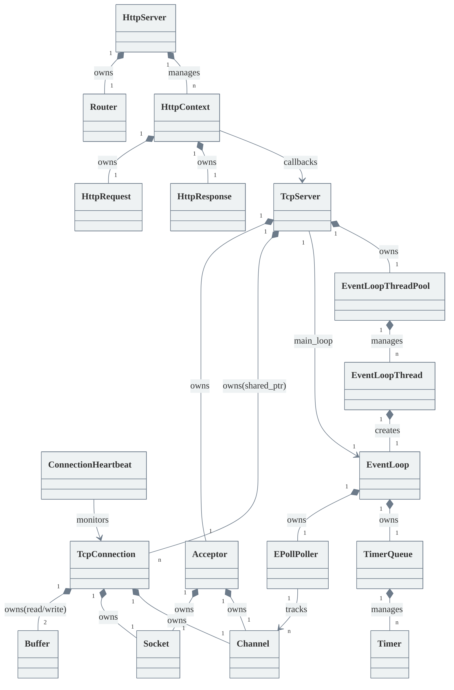
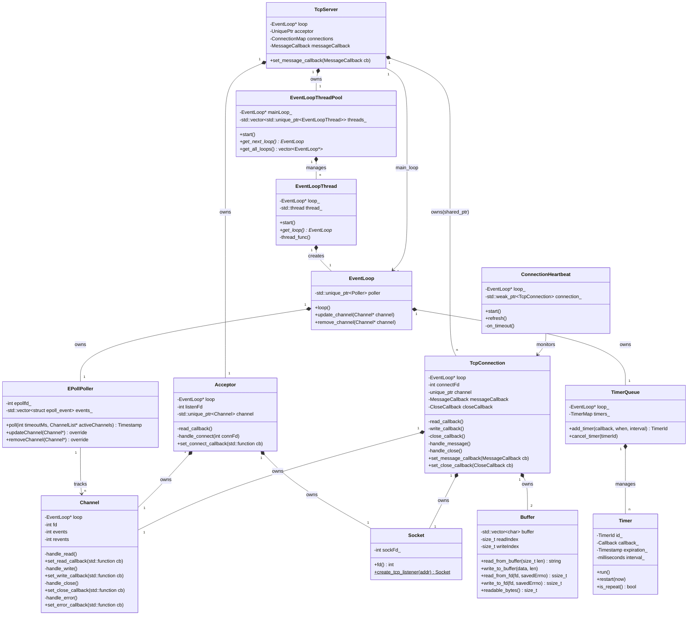
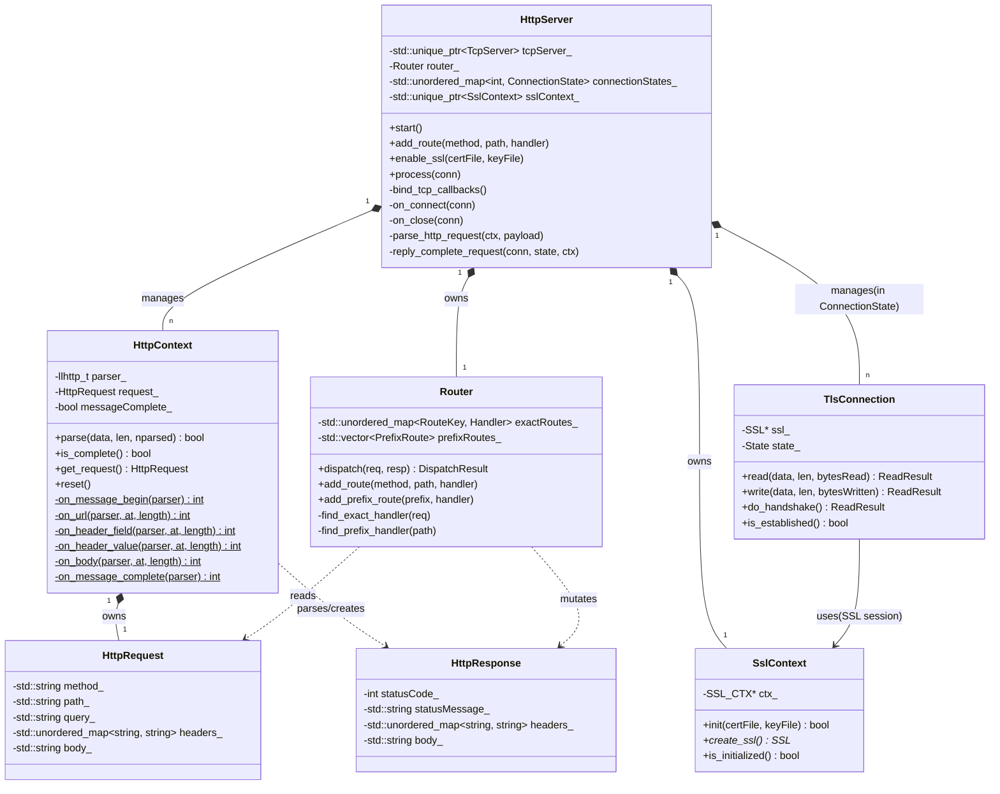
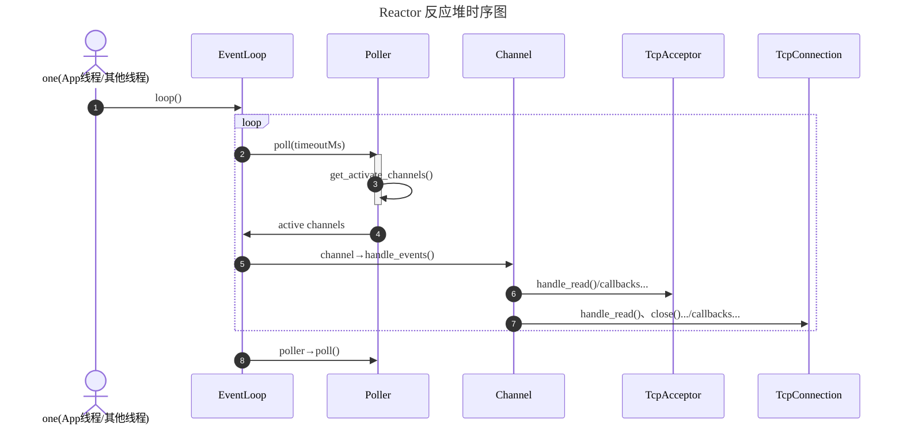
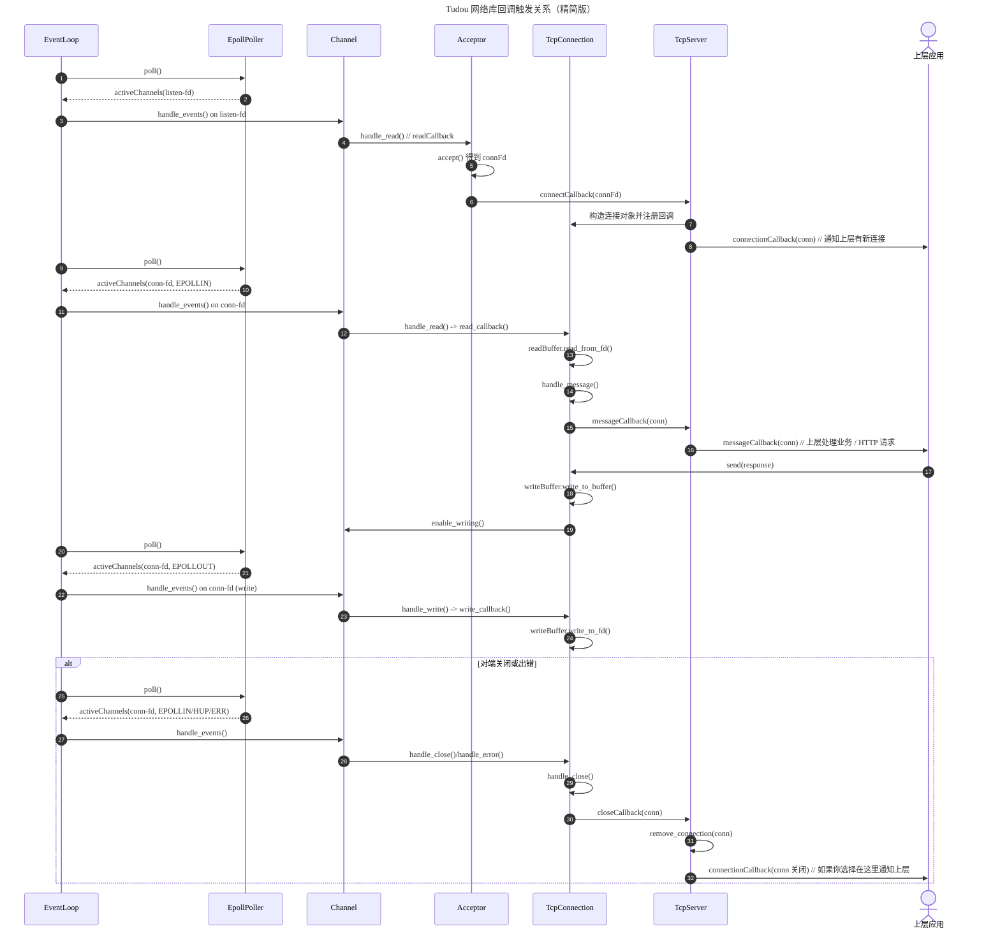

# Architecture Overview

```mermaid
%%{init: {
    "theme": "base",
    "themeVariables": {
        "fontFamily": "Inter, Helvetica, sans-serif",
        "fontSize": "16px",
        "primaryColor": "#eef2f3",
        "primaryTextColor": "#333",
        "primaryBorderColor": "#6c7a89",
        "lineColor": "#6c7a89",
        "secondaryColor": "#dce8f0",
        "tertiaryColor": "#fdfdfd"
    }
}}%%

flowchart TD
    %% 样式定义
    classDef appLayer fill:#f9e79f,stroke:#f39c12,stroke-width:2px,color:#333
    classDef httpLayer fill:#f5cba7,stroke:#d35400,stroke-width:2px,color:#333
    classDef tcpLayer fill:#aed6f1,stroke:#2980b9,stroke-width:2px,color:#333
    classDef reactorLayer fill:#abebc6,stroke:#27ae60,stroke-width:2px,color:#333
    classDef osLayer fill:#d2b4de,stroke:#8e44ad,stroke-width:2px,color:#333
    classDef invisible stroke-width:0,fill:none

    subgraph AppBusiness ["应用业务层 (App Layer)"]
        direction LR
        App["用户应用\n(StaticFileHttpServer / FileLinkServer / StarMind)"]
        UserCallbacks["业务回调\nonConnection()\nonMessage()\nonRequest()"]
        App --> UserCallbacks
    end

    subgraph HttpLayer ["HTTP/TLS 协议层 (Protocol Layer)"]
        direction TB
        HttpSrv["HttpServer"]
        HttpCtx["HttpContext\n(基于 llhttp)"]
        HttpReq["HttpRequest / HttpResponse"]
        TlsConn["TlsConnection / SslContext"]
        Router["Router 路由分发"]
        
        HttpSrv --> HttpCtx
        HttpSrv --> TlsConn
        HttpCtx --> HttpReq
        HttpSrv --> Router
    end

    subgraph NetLayer ["TCP 网络层 (TCP Layer)"]
        direction TB
        TcpSrv["TcpServer"]
        Acceptor["Acceptor\n处理新连接"]
        TcpConn["TcpConnection\n连接管理"]
        Buffer["Buffer\n读写缓冲区"]
        Heartbeat["ConnectionHeartbeat\n心跳机制"]
        
        TcpSrv -->|接受新连接| Acceptor
        TcpSrv -->|创建 & 管理| TcpConn
        TcpConn -->|数据缓冲| Buffer
        TcpConn -->|超时检查| Heartbeat
    end

    subgraph ReactorLayer ["Reactor 事件分发层 (Reactor Layer)"]
        direction TB
        ThreadPool["EventLoopThreadPool\n多线程模型"]
        MainLoop["Main EventLoop\n主反应堆"]
        SubLoop["Sub EventLoop\n子反应堆"]
        Poller["EpollPoller\nI/O 多路复用"]
        Channel["Channel\n事件分发"]
        TimerQ["TimerQueue / Timer\n定时任务队列"]
        
        ThreadPool --> MainLoop
        ThreadPool -->|分配连接| SubLoop
        MainLoop --> Poller
        SubLoop --> Poller
        Poller -->|触发事件| Channel
        SubLoop --> TimerQ
    end

    subgraph OS_Kernel ["操作系统层 (OS Kernel)"]
        direction LR
        Epoll["epoll\nepoll_wait()"]
        Socket["Sockets\naccept(), read(), write()"]
        EventFd["eventfd\n跨线程唤醒"]
        TimerFd["timerfd\n定时触发"]
        
        Epoll -.-> Socket
        Epoll -.-> EventFd
        Epoll -.-> TimerFd
    end

    %% 层级间依赖与数据流
    AppBusiness ==>|注册回调 & 业务处理| HttpLayer
    HttpLayer ==>|解析封装 & 依赖底层| NetLayer
    NetLayer ==>|事件注册与分发| ReactorLayer
    ReactorLayer ==>|系统调用| OS_Kernel

    %% 赋予各个Subgraph颜色
    class AppBusiness,App,UserCallbacks appLayer
    class HttpLayer,HttpSrv,HttpCtx,HttpReq,TlsConn,Router httpLayer
    class NetLayer,TcpSrv,Acceptor,TcpConn,Buffer,Heartbeat tcpLayer
    class ReactorLayer,ThreadPool,MainLoop,SubLoop,Poller,Channel,TimerQ reactorLayer
    class OS_Kernel,Epoll,Socket,EventFd,TimerFd osLayer
```

# Architecture UML

本文档包含服务端的核心类图，分为简略版（展示系统中各类之间的拓扑关系）和详细版（展示各模块的类详细设计）。

## 1. 类关系简略图

此图展示了系统中众多组件（涵盖 HTTP、TCP 和 Reactor 核心）之间的 UML 关系，重点在于表示组件之间的依赖、拥有和生命周期关系。利用连线方向和内置样式实现从上到下的自然分层与美化，并通过模块划分使结构更加清晰。

## 2. TCP / Reactor 模块核心类详细图

此图涵盖了 Reactor 模式的核心事件循环组件与 TCP 层的连接管理组件，详尽展示了各类的职责与接口。

## 3. HTTP 模块核心类详细图

此图专注于 HTTP 协议栈的解析与路由逻辑，涵盖 HttpServer 的生命周期与路由分发、TLS/SSL 加密层、HttpContext 的解析状态机、以及相关的 HTTP 请求与响应实体。

# 时序图

## Reactor 模式事件触发时序图

## TCP 模块事件触发时序图

