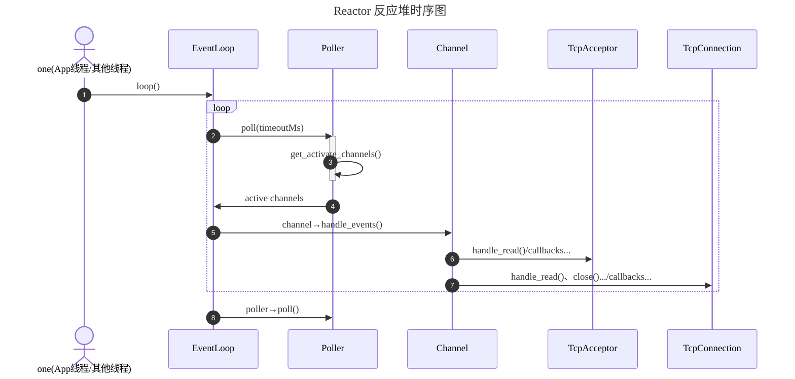

## 阻塞 IO 和非阻塞 IO

- **阻塞 IO**：当一个线程执行一个 IO 操作（例如读取数据）时：如果数据已经准备好，线程会立即返回数据；如果数据尚未准备好，线程会被阻塞，直到数据准备好为止。在阻塞期间，线程无法执行其他任务。阻塞 IO 的优点是实现简单，代码易于理解；缺点是线程在等待 IO 操作完成时会被阻塞，导致资源浪费，特别是在高并发场景下，可能需要大量线程来处理多个连接，增加了上下文切换的开销。

- **非阻塞 IO**：当一个线程执行一个 IO 操作时：如果数据已经准备好，线程会立即返回数据；如果数据尚未准备好，线程会立即返回一个错误或特殊值（例如 EAGAIN），表示数据不可用。线程可以继续执行其他任务，而不是被阻塞。非阻塞 IO 的优点是线程不会被阻塞，可以同时处理多个连接，提高了资源利用率和系统吞吐量；缺点是实现复杂，代码逻辑较难理解，需要频繁检查 IO 状态，可能导致忙等待（busy-waiting）的问题。

为什么需要非阻塞 IO？有时一次 IO 操作可能无法完成全部待接收数据的读写（例如 buffer 大小限制等）；accept() 一次只能接收一个新连接。我们为了避免 epoll_wait 多次返回可读事件（或者 accept 多次才能接收完所有新连接），就需要使用循环进行 IO 或者循环 accept 操作尽量在一次事件中完成尽可能多的数据的读写或者多的新连接的接收。在最后一次循环中，如果发现数据尚未准备好（read 返回 EAGAIN），就需要立即返回，不能阻塞等待数据准备好，否则就会影响 IO 性能。

epoll 的边沿触发（Edge Triggered，ET）和 水平触发（Level Triggered，LT）模式。epoll 本身并不区分阻塞 IO 和非阻塞 IO，它只是一个多路复用机制，负责监控多个文件描述符的状态变化。

1. 在使用 epoll 的水平触发（LT）模式时，文件描述符的状态变化会持续通知应用程序，直到应用程序处理完所有可用的数据为止。在这种模式下，应用程序可以通过 epoll_wait 检测到文件描述符的可读或可写状态，从而避免阻塞等待。因此，LT 模式下可以使用阻塞 IO，即使使用阻塞 IO，应用程序也不会被阻塞。

2. 在使用 epoll 的边沿触发（ET）模式时，文件描述符的状态变化只会在状态发生变化时通知应用程序一次。在这种模式下，我们通常需要在一次 IO 操作中将内核缓冲区中的所有数据都读完或写完，考虑到 buffer 大小限制，通常需要使用循环对内核缓冲区进行读写操作。在这种情况下，结合上面对阻塞 IO 和非阻塞 IO 的描述，为了避免最后一次循环发生阻塞影响性能，我们通常会将文件描述符设置为非阻塞模式，以便立即返回。因此，ET 模式下通常需要使用非阻塞 IO。

epoll 的 LT 编程更加简单，因为不需要考虑读写循环的问题，可以直接使用阻塞 IO；而 ET 编程更加复杂，需要处理读写循环的问题，通常需要使用非阻塞 IO。我们通常在高并发网络编程中使用非阻塞 IO，结合多路复用技术（如 epoll、select）来高效地管理多个连接，从而实现高性能的网络服务器。

## 生命周期管理：如何管理

**对象的生命周期应该始终由智能指针管理，而访问可以用裸指针或引用**。即两条原则：

1. **规则 A：对象生命周期由智能指针管理（unique/shared）**
2. **规则 B**：对象内部可以不持有另一个对象的强引用，访问可以使用裸指针（或引用）

**智能指针 = 负责释放（ownership） + 负责访问（access），裸指针 = 不负责释放，只是借用（non-owning） + 负责访问**。为什么“生命周期用智能指针，但访问用裸指针”是最佳实践？为什么不推荐“访问也用智能指针”（特别是 shared_ptr），额外的 atomic 引用计数操作会带来性能开销，而且容易引起循环引用的问题，而且从设计逻辑上来讲，你只是拿来访问，却给了它一个所有权，语义上就错了。为什么不推荐“访问用 weak_ptr”？也是使用慢且麻烦，从设计逻辑上来讲，weak_ptr 的目的不是访问，而是避免 shared_ptr 的循环引用，提供一种“可探测是否存在”的弱引用。所以最佳实践是：**当对象由动态分配产生时，其生命周期必须明确，由智能指针（unique_ptr / shared_ptr）管理**；所有不拥有所有权的引用，可以使用裸指针或引用（**但要注意尽量避免智能指针和裸指针混用时可能会导致的问题**）。使用裸指针的时候的关键就是：访问者必须确保被访问对象在访问期间是存活的（即生命周期未结束），当对象的生命周期结束时，所有持有裸指针的访问者都必须停止访问该对象；此时知道对象的生命周期何时结束是非常重要的。

**其实我觉得访问使用 shared_ptr 也是可以的，只是性能上会有损失，而且容易引起循环引用的问题**。智能指针和裸指针混用会带来很多的问题，混用时必须要注意裸指针只是访问，不拥有所有权，不负责释放对象。使用裸指针的优点是性能好，缺点是悬空指针风险大。

| 指针类型         | 适用场景                                               | 是否管理生命周期   | 性能          | 是否可能循环引用              | 最典型用途                                |
| ---------------- | ------------------------------------------------------ | ------------------ | ------------- | ----------------------------- | ----------------------------------------- |
| **裸指针（T*）** | **只引用、不拥有；对象生命周期由别人管理；高性能场景** | ❌ 不管理           | ⭐⭐⭐⭐⭐（最快） | ❌                             | EpollPoller 持有 Channel*                 |
| **unique_ptr**   | **单一所有权；严格的对象归属；析构必须明确**           | ✔ 唯一管理         | ⭐⭐⭐⭐          | ❌                             | TcpServer 持有 Acceptor；线程池；资源对象 |
| **shared_ptr**   | 对象需要多个组件共享、延迟析构；**回调不能被中途释放** | ✔ 多方共享         | ⭐⭐（最慢）    | ✔ 会循环引用（需配 weak_ptr） | TcpConnection；跨线程共享对象             |
| **weak_ptr**     | 观察 shared_ptr 生命周期；避免循环引用                 | ❌ 不管理（观察者） | ⭐⭐⭐           | ❌（本身可避免循环）           | xxx                                       |

## 生命周期管理：确保访问安全

1. 使用 std::weak_ptr 保存对象的弱引用，防止回调过程中对象被销毁，延长对象生命周期。使用实例：Channel 类的 tie 机制。而且只有通过 shared_ptr 管理的对象，才需要 tie 机制，因此设置了 isTied 标志位，对于非 shared_ptr 管理的对象，不需要 tie 机制，也不能调用 tie.lock()。

   ```cpp
   class channel{
       std::weak_ptr<void> tie;            // 绑定一个弱智能指针，延长其生命周期，防止 handle_events_with_guard 过程中被销毁。void 因为下层不需要知道上层类型
       bool isTied;                        // Acceptor 不需要 tie，TcpConnection 需要 tie (shared_ptr, shared_from_this)
   };
   
   void Channel::tie_to_object(const std::shared_ptr<void>& obj) {
       tie = obj;
       isTied = true;
   }
   
   void Channel::handle_events() {
       /*
       断开连接的处理并不简单：对方关闭连接，会触发 Channel::handle_event()，后者调用 handle_close_callback()。
       handle_close_callback() 调用上层注册的 closeCallback，TcpConnection::close_callback().
       TcpConnection::close_callback() 负责关闭连接，在 TcpServer 中销毁 TcpConnection 对象。此时 Channel 对象也会被销毁
       然而此时 handle_events_with_guard() 还没有返回，后续代码继续执行，可能访问已经被销毁的 Channel 对象，导致段错误
       见书籍 p274。muduo 的做法是通过 Channel::tie() 绑定一个弱智能指针，延长其生命周期，保证 Channel 对象在 handle_events_with_guard() 执行期间不会被销毁
       */
       /*
       通过弱智能指针 tie 绑定一个 shared_ptr 智能指针，延长其生命周期，防止 handle_events_with_guard 过程中被销毁
       只有对象是通过 shared_ptr 管理的，才能锁定。所以需要 isTied 标志
       Accetor 不需要 tie（因为没有 remove 回调，而且也不是 shared_ptr 管理的）；TcpConnection 需要 tie，其有 remove 回调，且是 shared_ptr 管理的
       */
       if (isTied) {
           std::shared_ptr<void> guard = tie.lock();
           if (guard) {
               this->handle_events_with_guard();
           }
       }
       else {
           handle_events_with_guard();
       }
   }
   ```

2. 使用 shared_ptr 代替 unique_ptr 管理对象生命周期，可以安全使用对象。例如使用 shared_ptr 以便在**缩小锁粒度**后，仍能安全在锁外使用对象（因为锁内拷贝了 shared_ptr，锁外使用时对象仍然有效）。

   ```cpp
   class HttpServer {
       std::unordered_map<int, std::shared_ptr<HttpContext>> httpContexts; // 以连接 fd 作为 key 维护每个连接的 HttpContext。使用 shared_ptr 以便在缩小锁粒度后，仍能安全在锁外使用 HttpContext
   };
   
   void HttpServer::parse_received_data(int fd, const std::string& data) {
       // 1. 在锁内只做 HttpContext 查找和 shared_ptr 拷贝，缩小临界区
       std::shared_ptr<HttpContext> ctx;
       {
           std::lock_guard<std::mutex> lock(contextsMutex);
           auto it = httpContexts.find(fd);
           if (it == httpContexts.end()) {
               spdlog::error("HttpServer: No HttpContext found for fd={}", fd);
               return;
           }
           ctx = it->second; // 拷贝 shared_ptr，保证在锁外使用时对象仍然存活
       }
   
       size_t nparsed = 0;
       bool ok = ctx->parse(data.data(), data.size(), nparsed);
       if (!ok) {
           // 解析失败，返回 400 Bad Request
           spdlog::debug("HttpServer::parse_received_data wrong. Bad request from fd={}", fd);
           HttpResponse resp = generate_bad_response();
           send_data(fd, resp.package_to_string());
           ctx->reset();
           return;
       }
   
       // 短连接场景下一般一次就收完；长连接场景可多次累积，这里先简单返回等待更多数据
       if (!ctx->is_complete()) {
           spdlog::debug("HttpServer::parse_received_data. HTTP request not complete yet, fd={}", fd);
           return;
       }
       spdlog::debug("HttpServer::parse_received_data ok. Complete HTTP request received from fd={}", fd);
   
       // 报文完整，进入业务处理逻辑
       process_data(fd, *ctx);
   }
   ```


## 深入理解回调

Tudou 是面向对象开发，因此我把回调定义为类之间的一种通信方式（**特别是从子类到父类，即“从下到上”的一种低成本的通信方式**），这种通信当然很大程度上是为了实现灵活的**事件处理和类之间的解耦**。回调函数实际上就**可以看作是上层类调用函数，只不过由下层类在事件发生时进行触发**。回调的特性有：

- **异步性**：回调的核心特性。回调通常在某个事件发生后被触发调用，而不是立即执行，这也是为什么我们选择回调而不是直接调用函数的原因，当我们**需要某个事件发生时触发执行某些操作**（Reactor 模式中尤为常见），这时可以通过设置回调（钩子）实现异步处理。

- **解耦**：回调允许**类之间通过函数接口（而不是某个抽象类）进行通信，比较轻便**。特别是子类需要依赖父类的某些功能时，回调可以让**子类在不直接依赖父类实现的情况下调用父类的方法**，从而实现解耦。

- **回调 VS 正常函数调用**：一般我们习惯的正常调用是从“上到下”的调用，或者可以想象一个大框不断嵌套小框、调用栈等，从上到下是大框套小框的过程、调用栈压栈的过程；**回调也是一个嵌套调用的过程，本质上也是函数调用，大框套小框、调用栈压栈的过程**，但**在类的设计中是从“下到上”的调用**。如果想象一个网络协议栈，回调就像是从底层协议栈向上层协议栈传递数据的过程（解包），而正常调用则是从上层协议栈向下层协议栈传递数据的过程（封包）。**总之，回调和正常函数调用在本质上没有区别，都是函数的嵌套调用；在类的通信上，回调是从下到上的调用，便捷地实现了下层类依赖上层类时的解耦**。

- **回调函数的参数和逻辑**：回调函数本质上是**属于上层类实现的逻辑（上层类的方法），只是由下层类触发**。因为上层类调用下层类时，通常使用组合（Composition）的方法，持有下层类（或“平级类”）的指针或引用（依赖注入），因此**回调函数的参数通常是下层类的实例或相关数据**，这样上层类就可以通过回调**函数**访问下层类的状态或行为。

  > 相邻层暴露时，为了简便可以直接传入下层的指针或引用（无需担心生命周期，若关系是上层持有下层，则回调过程中下层一定不会析构）

- **回调的实现方式**：在类的设计中，先在**子类**中定义一个保存回调函数的指针（或 std::function 对象，如 xxxCallback），然后提供一个设置回调函数的接口（public 方法，例如 set_xxx_callback），实现一个调用回调函数的私有方法（private 方法，例如 handle_xxx），在需要触发回调的地方调用这个私有方法即可。上层类需要实现回调函数逻辑（私有方法，例如 xxx_callback），在构造函数中初始化子类对象的时候，通过调用子类的设置回调函数接口将回调函数 xxx_callback 传递给子类（注册）。

- **如何记忆回调**（理解整个系统架构）：画一个类图，标明类之间结构关系，然后将类之间的回调关系（通信）用箭头表示出来（箭头从子类指向父类或从父类指向子类，虽然实际上是子类指向父类，但是回调逻辑上还是父类的方法其中参数来自于子类）。网络库通信项目中，记忆回调就从网络栈从下到上记忆，一层一层剥洋葱，每一层都需要把数据传递给上一层处理（例如 Tcp 收到数据包后，其中 Tcp 及其下面协议栈的包头已经被系统自动解析过了，回调给应用层 Http 解析去掉包头，然后 Http 解析完数据后回调给业务逻辑层处理数据），每一层都需要把处理后的数据传递给上一层进行处理。以 Tudou 项目为例，Event 触发读事件后，channel 调用 Channel::handle_event() 调用 tcpConnection 的回调方法 TcpConnection::read_callback()，tcpConnection 读取数据后（此时如果客户端是 Http，如果客户端是 Tcp 程序则没有应用层包头就不用解析），tcpConnection 调用 TcpConnection::handle_read() 调用 HttpServer::on_message() 回调方法，HttpServer 通过 HttpContext 解析 Http 数据，解析完后调用 HttpServer::handle_request() 回调处理业务层注入的回调逻辑。整个过程和普通函数调用没有区别，都是函数嵌套调用的过程，只不过从类的设计结构上来看，是从下到上的调用过程。

- **编程 Tips**：回调语法比较麻烦，我们可以**先把回调函数的框架搭好**（子类设置一个保存回调函数的成员，提供 public::set_xxx_callback + private::handle_xxx 方法，即 setter 和 触发；父类设置 private::xxx_callback，在构造函数中初始化子类对象的时候，通过调用子类的设置回调函数接口将回调函数 private::xxx_callback 传递给子类（注册）），具体逻辑可以先不实现。

对于每一个类，回答以下问题，有助于理解回调在类设计中的作用：

1. 这个类有哪些职责？（职责单一原则）
2. 这个类在哪个位置，需要和哪些其他类通信？（类之间的关系、通信）
3. 这些通信中，哪些是从上到下的调用（公有接口）
4. 这些通信中，哪些是从下到上的调用（回调方法）
5. **要使用一个类（或别人使用我），必须要设置哪些回调函数（依赖注入）？**
6. **在什么时候，其（我）会调用这些回调？**

在脑子里形成接口文档、调用栈，数据（类之间的通信）通过回调函数的传递路径。

> 回调就这样想，当我在底层类需要做一个事情时（调用函数），这个函数功能应该是由上层完成的，所以需要上层注入回调。例如，当 channel中的事件发生后，接下来应该从 fd读数据了，这个功能应该由上层类完成，所以就使用回调；TcpConn 读完数据后，接下来应该解析数据（如果是 http数据，否则直接让业务使用数据即可。）HttpServer解析数据也很 OK，上层访问下层，首先通过组合，然后就是设置 TcpServer的回调即可。如果理解了回调，也应该在 TcpConn、TcpServer里面加上 close回调！

> Tcp 的 messageCallback 应该返回处理数据后，需要发送的数据（或者将返回值放在参数里）。业务层需要发送数据，这个数据就放在返回值里。主要是**想把下层类屏蔽在上一层之外，出了上层类，上上层都屏蔽对其的感知最好**！（所有类最多暴露一层）。总之，数据出了 Tcpserver 即上层 messagecallback 就应该是 string，不应是 tcpconn，用户不应该知道 tcpconn：sendfileTcpserver 的第1、5步应该省去。虽然说是这样说，HttpServer 的 on_message 也应该返回 string 响应数据，但是为了方便用户构造 HttpResponse，所以还是传 HttpRequest 对象过去了，这样其实暴露了 HttpRequest 类、HttpResponse 类给了用户（能否设计更好的回调接口参数，从而向用户暴露更少，应该是可以的。例如可以将 HttpRequest 改为 method、path、query 等，用户写入一些信息给 HttpResponse，但是这样反而更麻烦了）。

> 网络库使用回调，业务处理使用事件总线怎么样？

## Reactor 模式



## 各类及其职责说明

- **EventLoop**：事件循环驱动者。持有 EpollPoller，使用 EpollPoller 获取 activeChannels 并驱动 activeChannels 触发回调处理事件
- **EpollPoller**：多路复用及 channels 管理中心。封装了 epoll_create、epoll_wait、epoll_ctl 等系统调用
- **Channel**：回调分发器。封装了 fd 及其感兴趣的事件，负责在事件发生时根据相应的事件调用相应的回调函数处理事件
- **Acceptor**：连接接受器。持有 fd、channel；还持有回调函数 connectCallback 用于执行上层 TcpServer 的连接回调，当建立新连接时触发调用。callback 用于处理 channel 新连接到来事件
- **TcpConnection**：TCP 连接封装器。持有 fd、channel、读写缓冲区 buffer；还持有回调函数 closeCallback、messageCallback 用于执行上层 TcpServer 的连接关闭回调和消息处理回调，当连接关闭、可读时触发回调。callback 用于处理 channel 读写事件和关闭事件
- **Buffer**：缓冲区类。持有 `vector<char>` 作为底层存储空间，设计参考 Netty 的 ByteBuf，提供向缓冲区写入数据、从缓冲区读取数据等接口供上层使用，也提供了向 fd 读写数据的接口用于 event 触发时 TcpConnection 的回调函数使用
- **TcpServer**：TCP 服务器。持有 acceptor 和管理 tcpConnections；还持有回调函数 connectionCallback、messageCallback 用于执行上层应用的连接建立、断开回调和消息处理回调，当有新连接建立（断开）、收到消息时触发调用。callback 用于处理 acceptor 的新连接事件和 tcpConnection 的断开、消息处理事件
- **llhttp**：HTTP 解析器（第三方库，Node.js 使用的 HTTP 解析器）。用于解析 HTTP 请求报文。
- **HttpResponse**：HTTP 响应封装器。用于构造 HTTP 响应报文。
- **HttpRequest**：HTTP 请求封装器。用于封装 HTTP 请求报文数据，类似一个数据结构体。
- **HttpContext**：HTTP 解析器。持有 llhttp 解析器实例、HttpRequest 实例，用于解析 HTTP 请求报文，并将解析结果存入 HttpRequest 实例中。
- **HttpServer**：HTTP 服务器。持有 TcpServer 实例；还持有回调函数 messageCallback 用于执行上层应用的 HTTP 请求处理回调，当收到 HTTP 请求时触发调用。callback（on_message、on_connection） 用于处理 TcpServer 的消息处理事件和连接建立、断开事件

> 陈硕为什么使用水平触发，且fd也不是非阻塞，见书平均只读一次（注重短而快的连接）

## fd 和 channel

fd 和 channel 生命期进行绑定，因为从逻辑上讲，channel 就是对 fd 的封装，是 fd 的抽象。fd 的生命周期由操作系统管理，而 channel 的生命周期由 Tudou 管理，为了避免悬空指针等问题，**channel 的生命周期必须和 fd 绑定在一起**，即**channel 的创建和销毁必须和 fd 的创建和销毁同步**。一个很好的方式就是使用 C++ 的 RAII(Resource Acquisition Is Initialization) 原则，在创建 fd 的时候同时创建 channel，在销毁 fd 的时候同时销毁 channel，这样可以确保 channel 始终有效，避免悬空指针等问题。因此在 TcpConnection、Acceptor 类中使用 RAII 原则同步管理 fd 和 channel 的生命周期。

## Others

1. ✅（已完成，例如 EventLoop 和 Channel，见 Commit 21ae66caeb34b21e18085e6cd2df515946d85a1c）画一颗类图，类之间只进行相邻类之间的通信（立马就清晰许多了），因此我们知道，update to epoll 应该由 channel做，而不是 Acceptor 和 Tcpconn！ 而且发现，自下而上的通信有两种实现方式：回调和依赖注入。我们或许可以只关注相邻类之间的通信（loop和channe是个例外，能够也融入该思想呢，好像可以！）！相邻类就是数据流通的路径，不应该跳，那样就是出现了环比较复杂！
   - epoll_wait是一个函数，同时执行自动扩缩x，遍历完再自动扩缩
   - get_activate_channels是一个函数
   - 对每个channel通知事件分发也是一个函数

2. ✅（已完成，例如 Channel 和 Epoller）。画一颗类图，类之间只进行相邻类之间的通信（立马就清晰许多了），因此我们知道，Channel 的 update_in_register() 和 remove_in_register() 应该由 Channel 自己调用，而不是上层 Acceptor 和 TcpConnection 调用！因为 Channel 封装了 fd，因此 close(fd) 也应该由 Channel 自己调用，而不是上层 Acceptor 和 TcpConnection 调用（生命期：虽然 fd 的创建是由上层负责，但销毁应该由 Channel 负责）！

3. **Tudou 复杂在：1、类组织设计结构非树，而是有环；2、需要自下到上通信。为了减轻复杂度，所以我们在设计类（的方法）时，尽量只让相邻类通信，避免跨越多层类通信。这样就能把复杂度降低很多。**


- TcpConnection 的生命周期非常复杂（许多回调函数参数都是 TcpConnection 的 shared_ptr），因此使用 shared_ptr 管理生命周期
- 回调函数不能直接用编辑器追踪函数跳转...可以用 handle_xxx() 方法名来查找对应的回调函数 xxx_callback() 实现位置