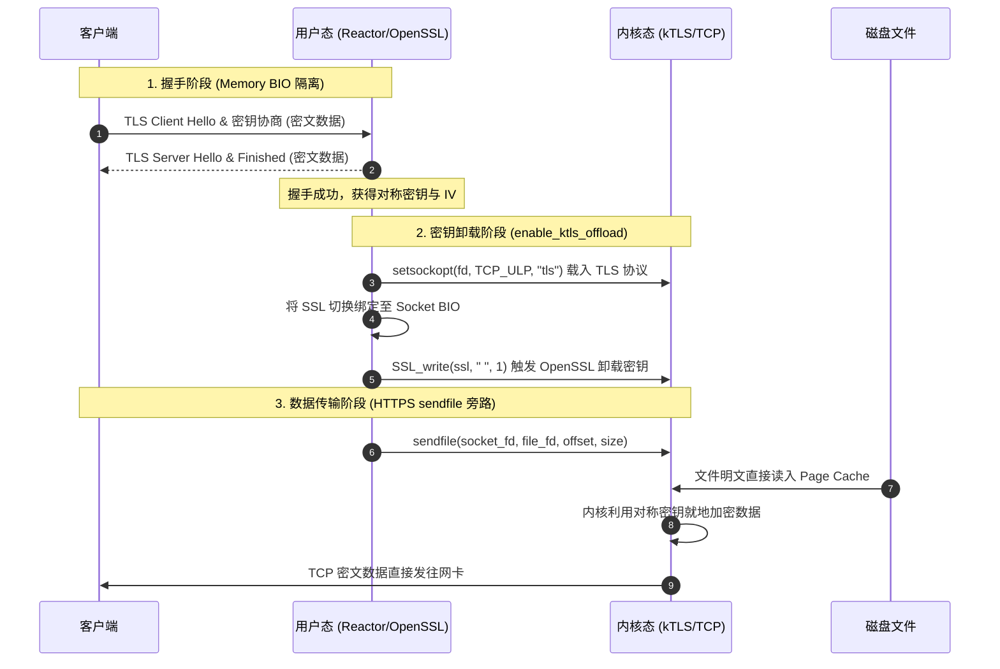
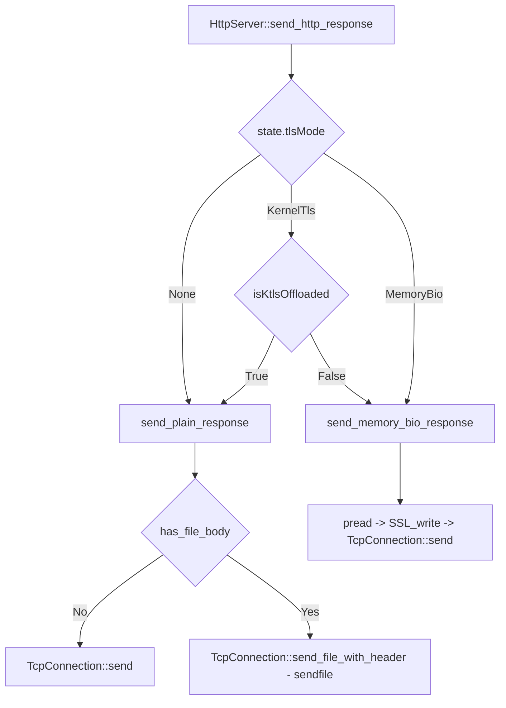

# Tudou 网络库零拷贝传输设计：从明文 HTTP 到 HTTPS kTLS 的 sendfile 加速

本篇文档完整记录了 Tudou 网络库在**明文 HTTP** 和 **加密 HTTPS** 场景下集成内核零拷贝发送（`sendfile`）的设计方案、架构逻辑以及工业级 fallback 实现。

---

## 1. 零拷贝技术深度分析：是什么与为什么

### 1.1 什么是零拷贝（Zero-Copy）？
零拷贝是一种计算机操作系统技术，旨在**消除或减少 CPU 在内核缓冲区与用户态缓冲区之间无意义的数据拷贝次数**，同时尽可能减少用户态与内核态之间的上下文切换（Context Switch）开销。

### 1.2 传统 I/O 静态文件发送的痛点
在传统的 I/O 模型中，将磁盘上的一个文件通过网络发送出去，通常需要经历 `read` 和 `write` 两个系统调用，整个过程会涉及 **4 次内存拷贝** 和 **4 次上下文切换**：

```
 用户态     |     [系统调用 read]      -> [系统调用 write]
           |      (切换1: 用户->内核)     (切换3: 用户->内核)
===========+=====================================================
 内核态     |  磁盘文件 -> Page Cache -> 用户缓冲区 -> Socket 缓冲区 -> 网卡
           |           [拷贝1]      [拷贝2]      [拷贝3]       [拷贝4]
           |         (DMA 拷贝)    (CPU 拷贝)   (CPU 拷贝)    (DMA 拷贝)
```

- **4 次内存拷贝**：
  1. **DMA 拷贝**：操作系统将文件从磁盘读入内核空间的 Page Cache 缓冲区。
  2. **CPU 拷贝**：用户进程调用 `read`，CPU 将数据从内核 Page Cache 拷贝到用户态内存缓冲区。
  3. **CPU 拷贝**：用户进程调用 `write`，CPU 将数据从用户态内存缓冲区拷贝到内核的 Socket 发送缓冲区。
  4. **DMA 拷贝**：网卡控制器通过 DMA 异步将 Socket 发送缓冲区的数据拷贝到网卡硬件中发走。
- **4 次上下文切换**：`read` 调用与返回（切换 x2），`write` 调用与返回（切换 x2）。

其中，**步骤 2 和 3 的 CPU 拷贝是纯粹的性能损耗**。在静态文件服务器中，用户态程序不需要对文件内容做任何修改，仅作为“网络传声筒”，这两次内存搬运白白榨干了 CPU 算力和系统总线带宽。

### 1.3 为什么要零拷贝？
1. **消除无意义的 CPU 拷贝**：让数据完全留在内核态进行流转，极大释放了 CPU 算力，降低了系统的 CPU 负载。
2. **减少上下文切换**：零拷贝系统调用（如 `sendfile`）将 `read` 和 `write` 合并为一个调用，直接减少了一半的系统上下文切换。
3. **节约内存带宽**：数据不需要拷入用户进程地址空间，节省了 L1/L2/L3 缓存与物理内存的总线频宽，让系统吞吐量呈线性上升。

---

## 2. 传统明文 HTTP 零拷贝在网络库的集成实现

对于明文 HTTP 连接，Tudou 网络库原生集成了 Linux 内核的 `sendfile` 系统调用，实现极致的文件发送性能。

### 2.1 sendfile 零拷贝原理
Linux 提供了一个高效的 `sendfile` 系统调用：
```c
ssize_t sendfile(int out_fd, int in_fd, off_t *offset, size_t count);
```
它允许内核直接将 `in_fd` (文件 fd) 关联的数据拷贝到 `out_fd` (Socket fd) 中。在 Linux 2.4+ 及支持 SG-DMA（Scatter-Gather DMA）的网卡上，整个过程仅需要 **2 次 DMA 拷贝** 和 **2 次上下文切换**，彻底消除了 CPU 拷贝：

```
 用户态     |                  [系统调用 sendfile] (切换 1 & 2)
===========+=====================================================
 内核态     |       磁盘文件 ----> Page Cache ------------> 网卡
           |                  [拷贝1: DMA]            [拷贝2: DMA]
```

### 2.2 Tudou 网络库非阻塞 sendfile 异步调度设计
在非阻塞 Reactor 架构下，直接调用 `sendfile` 发送大文件会面临以下挑战：
1. **TCP 头部必须先于文件体发出**：HTTP 头部（如 `HTTP/1.1 200 OK\r\nContent-Length: ...`）存放在用户态 Buffer 中，必须优先于文件明文发送。
2. **非阻塞 Socket 写入受限**：如果内核 Socket 缓冲区满了，`sendfile` 会立即返回 `EAGAIN` / `EWOULDBLOCK`，不能阻塞等待，需要通过 Epoll 异步驱动。

为了优雅处理该状态，Tudou 在 `TcpConnection` 中设计了 **带头部的非阻塞文件异步发送机制**：

```cpp
void TcpConnection::send_file_with_header(int fileFd, const std::string& header, size_t fileSize) {
    loop_->run_in_loop([self = shared_from_this(), fileFd, header, fileSize]() {
        self->send_file_in_loop(fileFd, header, fileSize);
    });
}
```

其核心执行状态机逻辑如下：

```
             +------------------------------+
             | send_file_with_header 被触发 |
             +--------------+---------------+
                            |
                            v
             +------------------------------+
             | 1. 将 HTTP Header 写入       |
             |    用户态 outputBuffer_      |
             +--------------+---------------+
                            |
                            v
             +------------------------------+
             | 2. 尝试向 Socket 刷新发送    |
             |    用户态已缓存的 Header 数据|
             +--------------+---------------+
                            |
             +--------------+--------------+
             |                             |
             v                             v
     (Header 未全部发完)           (Header 全部成功发出)
             |                             |
             v                             v
+--------------------------+  +-------------------------------+
| - 暂时不调用 sendfile     |  | 3. 直接调用非阻塞 sendfile()   |
| - 等待下一次可写事件触发  |  |    批量传送 Page Cache 内文件 |
| - writeCallback 中自动   |  +---------------+---------------+
|   推进 Header 及后续文件 |                  |
+--------------------------+          +-------+-------+
                                      |               |
                                      v               v
                              (文件已发完)    (遇到 EAGAIN 半包)
                                      |               |
                                      v               v
                              +---------------+ +----------------------------+
                              | 传输成功结束，| | - 保存当前文件 offset 与    |
                              | 释放文件 fd   | |   剩余未发字节 count       |
                              +---------------+ | - 向 Poller 注册可写事件   |
                                                | - writeCallback 触发后继续 |
                                                |   调用 sendfile 发送剩余段 |
                                                +----------------------------+
```

### 2.3 HttpServer 业务层零拷贝极简适配
应用层开发者完全无需处理繁琐的发送状态和 fd 生命周期。在 `HttpServer` 路由中，仅需声明文件 fd 和大小即可：
```cpp
server.add_get_route("/download", [](const HttpRequest& req, HttpResponse& resp) {
    int fd = ::open("largefile.zip", O_RDONLY | O_CLOEXEC);
    resp.set_status(200, "OK");
    resp.set_file_body(std::make_shared<ScopedFd>(fd), fileSize);
});
```
`HttpServer` 会在 `send_plain_response` 中自动读取该 body 状态，调用 `conn->send_file_with_header` 开启零拷贝分发。

---

## 3. HTTPS 零拷贝传输设计：基于 Linux kTLS 的 sendfile 加速

当网络升级为 HTTPS 时，用户态的数据必须经过 OpenSSL 的加密转换才能发送出去，这导致传统的 `sendfile` 彻底失效。为实现 HTTPS 下的零拷贝发送，Tudou 引入了 **Linux 内核 TLS (kTLS) 卸载技术**。

### 3.1 kTLS 工作原理
Linux kTLS（Kernel TLS）将 TLS 的**记录层（Record Layer）对称加密与解密下沉至内核**，而握手与密钥协商依然保留在用户态。其核心工作流如下：



在 kTLS 激活后，用户态网络库只需像处理普通明文 Socket 一样直接对 `fd` 执行读写或 `sendfile`。内核在发送时自动对数据进行 TLS 加密，在接收时自动解密，从而达到极致的吞吐量与极低的 CPU 占用。

### 3.2 平台支持性探测 (`TlsProbe`)
kTLS 依赖于特定的操作系统内核配置（如 `CONFIG_TLS=y`）及编译期 OpenSSL 库支持。本项目设计了 `TlsProbe` 模块：
- **编译期保障**：通过宏 `#if defined(__linux__) && defined(SSL_OP_ENABLE_KTLS) && defined(BIO_get_ktls_send) && TUDOU_HAS_LINUX_TLS_HDR` 保护，在非 Linux 或旧版 OpenSSL 环境下自动回退为不支持，避免编译报错。
- **运行期探测**：在测试或启动时创建一个真实的 TCP 套接字并尝试设置 `setsockopt(fd, IPPROTO_TCP, TCP_ULP, "tls")`。若系统支持则结果缓存并返回 `true`，防止在不支持的系统上盲目启用。

### 3.3 握手与卸载转移生命周期
由于非阻塞 Reactor 网络库架构高度依赖事件驱动，为防止 OpenSSL 的 Socket I/O 阻塞事件循环，握手和密钥卸载被明确划分为两个阶段：
1. **Memory BIO 握手**：
   - 握手阶段，`TlsConnection` 关联两个用户态 Memory BIO 缓冲区（`rbio_` 和 `wbio_`）。
   - 网络库异步收发密文并喂给 Memory BIO，驱动用户态握手。此时没有 `fd` 的直接介入，保障了 Reactor 的响应性。
2. **Socket BIO 密钥卸载**：
   - 当 `TlsConnection::is_established()` 返回 `true` 时，表示密钥协商结束。
   - 调用 `enable_ktls_offload(fd)`，在套接字上加载 TCP ULP `"tls"`。
   - 创建 `BIO_new_socket(fd)` 绑定至 `ssl_` 并释放旧的 Memory BIO。
   - 向 `ssl_` 写入 1 字节空格 `SSL_write(ssl_, " ", 1)`，**迫使 OpenSSL 在底层 Socket BIO 首次写 I/O 时运行其内置的 kTLS 密钥注入例程**（通过内核 `SOL_TLS` 写入对称密钥）。

---

## 4. 工业级优雅降级机制 (Fallback)

在真实生产环境中，kTLS 的密钥注入可能会因以下环境限制而失败：
- 容器沙盒权限限制（如缺少网络管理员权限导致 `setsockopt` 被拒）。
- 内核中未加载 `tls` 内核模块。
- 两端协商出了内核暂不支持的加密套件。

为保障服务的高可用性，本项目实现了**优雅降级机制**：

```cpp
// 握手就绪时，若为 kTLS 模式，立刻尝试将 socket 卸载至内核
if (state->tlsMode == TlsMode::KernelTls && state->tlsConnection->is_established()) {
    if (state->tlsConnection->enable_ktls_offload(conn->get_fd())) {
        state->isKtlsOffloaded = true;
    } else {
        // kTLS 卸载失败，优雅回退到 Memory BIO 用户态加密
        spdlog::warn("HttpServer: kTLS offloading failed, falling back to Memory BIO, fd={}", conn->get_fd());
        state->tlsMode = TlsMode::MemoryBio;
    }
}
```

- **失败安全性**：若 `enable_ktls_offload` 返回 `false`，则不设置 `isKtlsOffloaded = true` 并自动将该连接的 TLS 传输模式变更为 `TlsMode::MemoryBio`。
- **业务无感**：后续的读写请求将自动走原先成熟的用户态 Memory BIO 读写加密通道，连接不会被异常掐断，完全保障了 HTTPS 服务的高可用。

---

## 5. 接口分流与 HTTPS sendfile

在 `HttpServer` 业务层，响应发送路径被明确分流为三种模式，杜绝了隐含的业务逻辑判断：



### 5.1 明文发送分支 (`send_plain_response`)
当 `tlsMode == None`（普通明文 HTTP）或 `isKtlsOffloaded == true`（kTLS 成功接管的 HTTPS）时，均流向此接口。
- **非文件响应**：直接发送 HTTP 头部及 Body。
- **文件响应**：通过 `TcpConnection::send_file_with_header` 调用 Linux 内核 `sendfile` 执行零拷贝传输。对于 kTLS 连接，内核会自动在 Page Cache 加密数据发送，即 **HTTPS sendfile**。

### 5.2 用户态解密分支 (`send_memory_bio_response`)
当处于 `TlsMode::MemoryBio` 或 kTLS 降级状态时，执行传统用户态发送：
- 读取文件段 -> `SSL_write` 加密 -> 发送加密密文。虽然非零拷贝，但兼容性最强。
