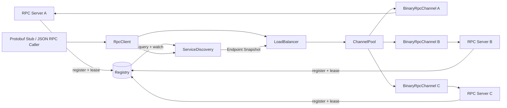

# Tudou RPC 服务发现与多实例负载均衡设计

## 1. 问题背景

Tudou 已经提供两套 RPC 能力：

- JSON-RPC 2.0：文本协议，适合跨语言调试和免 IDL 调用；
- Protobuf Binary RPC：基于 Protobuf 描述符和反射进行服务路由，使用二进制长度分帧；
- `BinaryRpcChannel` 通过 `sequenceId` 在一条 TCP 长连接上匹配并发请求和响应；
- 在 EventLoop 模式下，支持使用 Boost.Coroutine2 挂起和恢复 RPC 调用协程。

但是，上述能力主要解决的是**已经知道服务端地址后，如何高效、正确地完成 RPC 调用**。

在真实分布式环境中，同一个服务往往会启动多个实例：

```text
OrderService
├── 10.0.0.11:8000
├── 10.0.0.12:8000
└── 10.0.0.13:8000
```

此时客户端不应当在业务代码中硬编码所有 IP 和端口，而应当只依赖逻辑服务名，例如 `OrderService`。

因此，完整的多实例 RPC 调用还需要解决三个问题：

1. 哪些 Server 实例正在提供某个服务；
2. 实例上线、下线或宕机后，Client 如何感知；
3. 当存在多个可用实例时，一次调用应该发给谁。

这就是服务注册、服务发现和负载均衡需要解决的问题。

---

## 2. 当前项目的真实边界

### 2.1 当前是静态地址直连

当前 `BinaryRpcChannel` 的两个构造函数都要求传入明确的 `ip` 和 `port`：

```cpp
BinaryRpcChannel(const std::string& ip, uint16_t port);
BinaryRpcChannel(EventLoop* loop, const std::string& ip, uint16_t port);
```

`JsonRpcClient` 也同样在构造时直接建立到指定地址的 TCP 连接。因此，Tudou 当前的定位是：

> 客户端已经知道目标 RPC Server 的 IP 和端口，Channel 负责连接该 Server 并完成请求传输。

项目目前**尚未实现注册中心、服务发现、多节点负载均衡和 Channel 连接池**。

### 2.2 “服务路由注册”不等于“服务发现”

`BinaryRpcRouter::register_service()` 和 `JsonRpcRouter::register_method()` 所完成的是 Server 进程内的方法路由：

```text
已到达 Server 的请求
        ↓
serviceName + methodName
        ↓
查找本地 Service/Handler
        ↓
执行业务方法
```

服务发现则发生在请求发出之前：

```text
逻辑服务名 OrderService
        ↓
查找哪些 Server 提供该服务
        ↓
选择一个 Server 实例
        ↓
取得对应 Channel 并发送请求
```

两者都会使用“注册”这个词，但所处层次不同：

| 机制 | 所在位置 | 解决的问题 |
| --- | --- | --- |
| 本地路由注册 | RPC Server 进程内 | 一个请求到达后执行哪个方法 |
| 服务注册与发现 | Client 与 Server 之间 | 请求在发出前应该连接哪台 Server |

### 2.3 单连接多路复用不等于多实例负载均衡

`BinaryRpcChannel` 的 `sequenceId -> ResponseContext` 映射解决的是：

> 多个线程或协程如何共用同一条 TCP 连接，并将乱序到达的响应交还给正确的调用者。

多实例负载均衡解决的则是：

> 同一个服务存在多个 Server 时，这次请求应该选择哪个 Server。

两者的关系可以概括为：

```text
多实例负载均衡：在多条 Channel/多台 Server 之间选一个
单连接多路复用：在选中的一条 Channel 内承载多个并发请求
```

---

## 3. 目标架构

如果将 Tudou 扩展为支持多实例的 RPC 框架，可以在现有 Channel 之上增加服务发现、负载均衡和连接管理层：



一次完整调用的主流程为：

1. Server 启动并将服务实例注册到注册中心；
2. Client 按服务名订阅实例列表，并维护本地快照；
3. 调用发生时，负载均衡器从快照中选择一个可用 Endpoint；
4. ChannelPool 返回对应的已建立长连接，必要时才新建连接；
5. `BinaryRpcChannel` 使用 `sequenceId` 发送并匹配请求；
6. 调用成功后更新节点延迟等统计；失败时进入健康管理、熔断或受控重试流程。

---

## 4. 服务注册

### 4.1 注册数据

一个服务实例不应只注册 IP 和端口，而应当包含必要的路由与治理元数据：

```cpp
struct ServiceInstance {
    std::string serviceName;  // tudou.rpc.OrderService
    std::string instanceId;   // 实例唯一标识
    std::string host;
    uint16_t port;
    std::string protocol;     // binary-rpc / json-rpc
    std::string version;      // v1 / v2
    std::string zone;         // 可用区或机房
    int weight;               // 负载均衡权重
};
```

`instanceId` 应当能区分同一机器或同一 IP 上的多个进程。对于动态调度环境，不能默认 IP 永久不变。

### 4.2 存活性维持

常见有两种方案：

- **临时节点**：Server 与注册中心的会话断开后，节点自动删除；
- **租约与续租**：Server 定期续租，超过 TTL 未续租则判定实例失活。

无论采用 etcd、ZooKeeper 还是 Consul，关键都是让 Server 宕机后的注册信息能够最终自动消失，避免长期存在脏节点。

### 4.3 优雅下线

正常停机时，Server 应先进入 draining 状态：

1. 从注册中心注销，或将实例标记为不再接收新流量；
2. 等待已在处理的 RPC 请求完成；
3. 超时后终止剩余请求并关闭长连接；
4. 退出进程。

如果直接先关进程再等待 TTL 过期，Client 会在这个时间窗口内继续选中已下线节点。

---

## 5. Client 端服务发现

### 5.1 本地快照

Client 不应当每次 RPC 调用都请求注册中心，否则注册中心就会进入每次调用的关键路径，带来额外延迟和单点风险。

更合理的方式是：

1. Client 启动时全量拉取一次实例列表；
2. 在内存中保存不可变的 Endpoint 快照；
3. 通过 watch/订阅接收后续变更；
4. 收到变更后构造新快照，再原子替换旧快照；
5. RPC 调用线程只读取快照，不与注册中心交互。

这样可以让请求路径保持简单，也能降低读写竞争。

### 5.2 全量拉取与增量 watch 的一致性

不能简单地“先查询，再 watch”而忽略两个操作之间的变更。否则，某个实例如果恰好在窗口期上线或下线，Client 可能永久遗漏该事件。

正确方案需要借助注册中心的 revision/version：

1. 拉取实例列表及对应 revision；
2. 从 `revision + 1` 开始订阅变更；
3. watch 断开后，从最后成功处理的 revision 恢复；
4. 如果历史事件已被压缩，重新执行全量同步。

### 5.3 注册中心不可用

注册中心短暂不可用时，Client 可以继续使用最后一份本地快照，但要考虑快照可能过期：

- 已有 Channel 可继续尝试使用；
- 连接失败的节点由客户端被动健康检查暂时摘除；
- 后台使用指数退避和随机抖动重连注册中心；
- 恢复后执行全量对账，而不是假设中断期间没有变更。

---

## 6. 多实例负载均衡

### 6.1 轮询

轮询依次选择各个可用节点，实现简单，适合实例能力和请求成本较为接近的场景。

但在 RPC 请求耗时差异较大时，请求数量平均不等于 Server 负载平均。

### 6.2 加权轮询

对配置更高或承载能力更强的实例设置更大权重。该方案还可以用于灰度发布，例如先让新版本承担 5% 流量。

### 6.3 最少未完成请求

对每个 Channel 统计当前 in-flight RPC 数量，优先选择挂起请求较少的节点。

对 Tudou 而言，`pendingRequests_.size()` 可以反映一条 Binary Channel 上的未完成请求数，但负载均衡层不应直接访问 Channel 的内部容器，而应由 Channel 暴露有限的只读指标。

### 6.4 延迟感知选择

可以使用 EWMA 统计节点近期延迟，并结合 in-flight 数量选择节点。这比单纯轮询更能适应慢节点，但实现和参数调试更复杂。

### 6.5 一致性哈希

当请求希望按 `userId`、`roomId` 或其他业务 key 稳定路由到同一节点时，可使用一致性哈希。这对本地缓存命中率或有状态业务有价值，但应该谨慎避免将不必要的会话状态固化在单个 Server 内。

### 6.6 选择策略的演进顺序

对于 Tudou 的首次实现，建议顺序是：

1. 先实现简单 Round Robin，验证完整链路；
2. 增加实例权重与加权轮询；
3. 增加 in-flight、延迟和失败率指标；
4. 只在出现明确业务需求时再引入一致性哈希或自适应负载均衡。

---

## 7. ChannelPool 与长连接管理

### 7.1 为什么需要 ChannelPool

服务发现返回的是 Endpoint，而真正发送 RPC 需要已建立的 Channel。如果每次调用都重新建立 TCP 连接，会增加握手延迟、系统调用和端口资源消耗，也无法发挥单连接多路复用的价值。

ChannelPool 的职责是：

- 维护 `Endpoint -> Channel/Channels` 映射；
- 懒创建或预热长连接；
- 处理断线、重连和退避；
- 实例下线时先停止分配新请求，再排空并关闭 Channel；
- 限制单实例连接数和全局连接数。

### 7.2 一个实例是否只需要一条连接

由于 Binary RPC 已支持单连接多路复用，一个实例一条 Channel 可以作为初始方案。但一条连接仍可能面临：

- 单连接的拥塞窗口和带宽上限；
- 大响应造成的 TCP 层队头阻塞；
- 连接中断时，该连接上所有 in-flight 请求同时失败；
- 单个 EventLoop 或收发路径的处理能力上限。

因此在有实际压测数据支持时，可为一个 Endpoint 维护少量多条 Channel，并按 in-flight 数选择连接。不应在缺乏数据时预先建立大规模连接池。

### 7.3 EventLoop 线程归属

协程版 `BinaryRpcChannel` 依赖外部 `EventLoop`，并通过 Reactor 回调驱动连接、读写与协程恢复。因此 ChannelPool 还需要尊重 EventLoop 的线程归属：

- Channel 的创建、事件修改和销毁应在所属 EventLoop 线程执行；
- 不能随意将一个绑定 Loop A 的 Channel 迁移到 Loop B；
- 多 EventLoop 场景可以维护 loop-local ChannelPool，避免所有调用竞争一个全局锁；
- 服务发现快照可全局共享，但 Channel 的生命周期由所属 Loop 管理。

---

## 8. 健康检查、熔断与重试

### 8.1 注册中心不能代替客户端健康检查

租约过期存在时间窗口，并且 Server 进程存活不代表 RPC 业务一定正常。例如：

- Server 的 EventLoop 卡死；
- 业务线程池耗尽；
- Server 与依赖的数据库断开；
- Client 到某个 Server 的局部网络不可达。

因此客户端还需要根据真实调用结果进行被动健康管理，必要时增加应用层 Ping/Pong 主动探活。

### 8.2 熔断

对持续连接失败、超时或错误率过高的节点，可将其暂时标记为不可用：

```text
Closed（正常放行）
   ↓ 错误达到阈值
Open（快速失败，不再选择）
   ↓ 冷却时间到达
Half-Open（少量探测请求）
   ├── 成功 → Closed
   └── 失败 → Open
```

熔断最好按 Endpoint 和服务维度统计，不应因为一台 Server 故障就将整个服务熄断。

### 8.3 超时

没有超时的 RPC 调用会无限占用 `pendingRequests_`、协程上下文和业务资源。服务治理扩展应当优先引入 deadline：

- 调用方设置绝对 deadline 或相对 timeout；
- Channel 超时后从 `pendingRequests_` 移除上下文；
- 恢复协程或唤醒 future，向上层返回超时错误；
- 超时后到达的迟到响应应当被安全丢弃；
- 跨服务调用时向下游传递剩余 deadline，避免每一层都重新获得一份完整超时。

### 8.4 重试边界

重试不能仅以“第一次没成功”为条件。必须同时考虑：

- **幂等性**：查询类请求通常可重试；扣款、创建订单等非幂等操作可能重复执行；
- **失败阶段**：连接建立前失败与请求已发出但响应丢失的语义不同；
- **deadline**：重试必须共享原调用的时间预算；
- **次数与退避**：必须设置上限并加入抖动，避免故障时产生重试风暴；
- **节点切换**：如果决定重试，通常应排除本次已失败的 Endpoint。

如果业务必须对非幂等操作开启重试，应当使用业务唯一请求号配合 Server 端去重，而不能只依赖单条连接上的 `sequenceId`。

---

## 9. 客户端负载均衡与服务端负载均衡

### 9.1 客户端负载均衡

Client 直接获取所有 Server 实例，并在本地选择节点。

优点：

- 少一次中间转发；
- 可结合客户端观测到的延迟和错误率选择节点；
- 易于实现按业务 key 的一致性哈希。

缺点：

- Client 需要实现发现、缓存、负载均衡和连接治理；
- 多语言 Client 需要维护一致的治理语义；
- Server 数量很大时，可能导致连接数扩张。

### 9.2 服务端负载均衡

Client 只连接 Nginx、LVS、云负载均衡器或其他统一入口，由中间层选择后端实例。

优点：

- Client 简单，只需知道一个稳定地址；
- 便于集中进行访问控制、限流与运维。

缺点：

- 增加一次转发；
- 统一入口本身需要高可用部署；
- 中间层未必能感知客户端的业务路由语义。

两种方式不是绝对互斥的。例如跨机房流量可以先通过统一入口，机房内的服务之间再使用客户端服务发现。

---

## 10. 与 Tudou 现有模块的结合方式

可以使用以下职责划分：

```cpp
struct Endpoint {
    std::string instanceId;
    std::string host;
    uint16_t port;
    int weight;
};

class ServiceDiscovery {
public:
    // 返回当前不可变快照，不进行远程查询
    virtual std::shared_ptr<const std::vector<Endpoint>>
    lookup(const std::string& serviceName) const = 0;
};

class LoadBalancer {
public:
    virtual Endpoint select(
        const std::vector<Endpoint>& endpoints,
        const RpcCallContext& context) = 0;
};

class ChannelPool {
public:
    std::shared_ptr<BinaryRpcChannel> get(const Endpoint& endpoint,
                                          EventLoop* loop);
};

class RpcClient {
public:
    void call(const std::string& serviceName,
              const google::protobuf::MethodDescriptor* method,
              const google::protobuf::Message* request,
              google::protobuf::Message* response);
};
```

上层 `RpcClient::call()` 展开完整业务流程：

```cpp
void RpcClient::call(/* ... */) {
    auto endpoints = discovery_->lookup(serviceName);
    Endpoint endpoint = loadBalancer_->select(*endpoints, context);
    auto channel = channelPool_->get(endpoint, loop_);
    channel->CallMethod(method, controller, request, response, done);
}
```

这种分层保留了现有 `BinaryRpcChannel` 的单一职责：

- `ServiceDiscovery` 只回答“有哪些实例”；
- `LoadBalancer` 只回答“本次选谁”；
- `ChannelPool` 只管理“如何复用和维护连接”；
- `BinaryRpcChannel` 继续处理“如何在一条连接上发送、分帧和匹配响应”。

对于第一个可运行版本，不需要立即引入多个注册中心适配器或通用 DI 容器。可以先使用具体的 `StaticServiceDiscovery` 完成分层和多节点路由，再增加一个真实注册中心实现。

---

## 11. 建议的增量实现路径

### 阶段一：静态多节点

- 定义 `Endpoint` 和 `StaticServiceDiscovery`；
- 允许配置一个服务的多个地址；
- 实现 Round Robin；
- 实现 `Endpoint -> BinaryRpcChannel` 缓存；
- 验证请求可均匀到达多个 Server。

这一阶段先验证分层和连接生命周期，不引入外部中间件。

### 阶段二：动态发现

- 选择一种注册中心；
- Server 实现注册、续租和优雅注销；
- Client 实现全量拉取、watch 和本地快照；
- 实例下线时执行 Channel draining；
- 注册中心不可用时验证本地快照降级。

### 阶段三：健康与容错

- 实现 RPC deadline 和超时清理；
- 统计 Endpoint 级错误率、延迟和 in-flight 请求；
- 实现被动摘除和半开探测；
- 仅对明确标记为幂等的方法开启受控重试；
- 增加服务发现、选址和 Channel 的可观测指标。

### 阶段四：高级路由

- 加权轮询和灰度版本路由；
- 同机房或同可用区优先；
- 延迟感知负载均衡；
- 有明确业务需求时再实现一致性哈希。

---

## 12. 测试要点

服务发现和多实例调度不能只验证正常路径，至少应覆盖：

### 功能测试

- 服务名能够解析为正确的 Endpoint 列表；
- 轮询策略在多节点间正确分布请求；
- 服务不存在或无可用实例时返回明确错误；
- 不同协议、版本和标签能够正确过滤。

### 动态变更测试

- Server 上线后 Client 能够收到新节点；
- Server 正常下线后不再接收新请求；
- Server 崩溃后租约过期并被移除；
- watch 断开、恢复和 revision 压缩后不丢失最终状态。

### 容错测试

- 注册中心停机时，已有服务能否使用本地快照继续调用；
- 选中的 Server 拒绝连接时，是否正确摘除并选择其他节点；
- Channel 断开时，所有 pending 请求是否都被唤醒；
- 超时请求是否从映射表移除，迟到响应是否安全丢弃；
- 故障节点恢复后是否会通过探测重新进入候选列表。

### 并发测试

- 发现快照更新与 RPC 并发读取时没有数据竞争；
- 节点下线与 Channel 取用同时发生时没有悬空指针；
- 多 EventLoop 场景下 Channel 始终在所属线程操作；
- 高并发下负载均衡器不会成为全局锁热点。

---

## 13. 面试回答模板

### 13.1 简洁版

> 我这个项目当前实现的是 RPC 协议、服务端方法路由、单连接多路复用和协程调用，Client 目前在创建 Channel 时直接传入 IP 和端口，所以严格来说还没有实现注册中心意义上的服务发现。
>
> 如果扩展到多个 RPC Server，我会让 Server 把服务名、IP、端口、协议和版本注册到 etcd 或 ZooKeeper，并通过租约或临时节点维持存活。Client 启动时拉取实例列表并 watch 变更，在本地维护快照。调用时先通过轮询、加权轮询或一致性哈希选择节点，再从 ChannelPool 取得对应长连接。
>
> 现有 `BinaryRpcChannel` 负责单台 Server、单条连接内的 `sequenceId` 多路复用；服务发现和负载均衡则负责多台 Server 之间的选址，它们是两个不同层次的问题。

### 13.2 最需要记住的区分

> 单连接多路复用解决“一条连接如何承载多个并发请求”；服务发现和负载均衡解决“存在多个服务实例时，这次请求应该发给谁”。

### 13.3 注册中心宕机时

> 注册中心不应该出现在每次 RPC 调用的关键路径上。Client 应维护本地实例快照，注册中心短暂不可用时继续使用已知节点，同时通过实际连接和调用结果被动摘除故障节点。后台恢复与注册中心的连接后，再进行全量对账。

### 13.4 为什么不直接用 Nginx

> 可以使用。Nginx、LVS 或云负载均衡属于服务端负载均衡，Client 只需连接统一入口，实现更简单。注册中心配合客户端负载均衡则让 Client 直接连接后端，少一次转发，并能依据延迟、权重或业务 key 选择节点，但 Client 的连接治理更复杂。

---

## 14. 简历描述的边界

当前可以准确地描述为：

> 实现灵活的 JSON-RPC 与基于 Protobuf 的二进制 RPC 双模块；二进制 Channel 基于 `sequenceId` 支持单 TCP 长连接的多线程请求复用和响应匹配，并提供基于 Boost.Coroutine2 的协程调用路径，降低高并发调用中的线程阻塞与上下文切换开销。

在尚未实现本文所述模块之前，不应声称项目已支持：

- 注册中心接入；
- 服务自动注册与发现；
- 多 RPC Server 客户端负载均衡；
- 完整的 ChannelPool、熔断、超时和自动重试机制。

协程的价值也应当更严谨地表述为**改善高并发场景下的调度开销、线程利用率和并发承载能力**，而不是笼统地声称它必然降低单次 RPC 的网络延迟。

---

## 15. 总结

Tudou 当前的 RPC 实现已经覆盖了协议编解码、Server 本地路由、单连接多路复用与协程化调用，但 Client 仍使用静态 `IP:Port` 直连。

要支持多个 RPC Server，需要在现有 Channel 之上补充：

```text
服务注册
    ↓
本地缓存式服务发现
    ↓
负载均衡
    ↓
ChannelPool
    ↓
超时、健康检查、熔断和受控重试
```

最核心的设计原则是：

1. 注册中心不进入每次 RPC 调用的关键路径；
2. 服务发现、节点选择、连接管理和单连接传输分层负责；
3. 注册中心的存活信息与 Client 观测到的真实健康状态需要同时使用；
4. 重试必须受 deadline、幂等性和重试预算约束；
5. 优先通过静态多节点和轮询完成最小闭环，再根据测试和压测结果逐步增加复杂治理能力。
